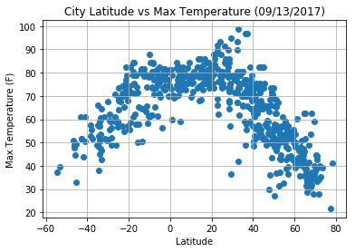
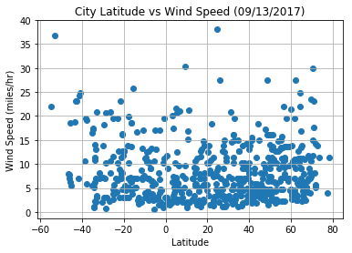

```python
import csv
import matplotlib.pyplot as plt
import requests as req
import pandas as pd
import numpy as np

```


```python
######################################################
#- Take all Cities within the sample lat/long range
######################################################

from citipy import citipy

city_df=pd.DataFrame(columns=('city_name','country_cd','lat','lng'),index=np.arange(1))
tcity_df=pd.DataFrame(columns=('city_name','country_cd','lat','lng'),index=np.arange(1))

ctr=0
lng = -180
while lng<180:
    for lat in range(-90,91):                 
        city = citipy.nearest_city(lat,lng)             
        tcity_df["city_name"]=city.city_name
        tcity_df["country_cd"]=city.country_code
        tcity_df["lat"]=lat
        tcity_df["lng"]=lng               
        #print("Lat: "+str(lat)+" Long:"+str(lng))

        if ctr==0:
            city_df=tcity_df
        else:
            city_df=city_df.append(tcity_df,ignore_index=True)
        ctr+=1            
    lng+=5


     

```


```python
#######################################            
# Take initial random sample of 12%
# from non-deduped data. Use this to
# identify sample cities for geocoding
#######################################
city_df=city_df.sample(frac=.12)
city_df
```


<div>
<style>
    .dataframe thead tr:only-child th {
        text-align: right;
    }

    .dataframe thead th {
        text-align: left;
    }

    .dataframe tbody tr th {
        vertical-align: top;
    }
</style>
<table border="1" class="dataframe">
  <thead>
    <tr style="text-align: right;">
      <th></th>
      <th>city_name</th>
      <th>country_cd</th>
      <th>lat</th>
      <th>lng</th>
    </tr>
  </thead>
  <tbody>
    <tr>
      <th>9376</th>
      <td>okoneshnikovo</td>
      <td>ru</td>
      <td>55</td>
      <td>75</td>
    </tr>
    <tr>
      <th>3427</th>
      <td>qaanaaq</td>
      <td>gl</td>
      <td>79</td>
      <td>-90</td>
    </tr>
    <tr>
      <th>10159</th>
      <td>albany</td>
      <td>au</td>
      <td>-67</td>
      <td>100</td>
    </tr>
    <tr>
      <th>7970</th>
      <td>port alfred</td>
      <td>za</td>
      <td>-84</td>
      <td>40</td>
    </tr>
    <tr>
      <th>12775</th>
      <td>butaritari</td>
      <td>ki</td>
      <td>15</td>
      <td>170</td>
    </tr>
    <tr>
      <th>7719</th>
      <td>abnub</td>
      <td>eg</td>
      <td>27</td>
      <td>30</td>
    </tr>
    <tr>
      <th>7801</th>
      <td>port elizabeth</td>
      <td>za</td>
      <td>-72</td>
      <td>35</td>
    </tr>
    <tr>
      <th>7025</th>
      <td>gistrup</td>
      <td>dk</td>
      <td>57</td>
      <td>10</td>
    </tr>
    <tr>
      <th>7530</th>
      <td>kutum</td>
      <td>sd</td>
      <td>19</td>
      <td>25</td>
    </tr>
    <tr>
      <th>3240</th>
      <td>thompson</td>
      <td>ca</td>
      <td>73</td>
      <td>-95</td>
    </tr>
    <tr>
      <th>11378</th>
      <td>batagay-alyta</td>
      <td>ru</td>
      <td>66</td>
      <td>130</td>
    </tr>
    <tr>
      <th>7494</th>
      <td>kasane</td>
      <td>bw</td>
      <td>-17</td>
      <td>25</td>
    </tr>
    <tr>
      <th>1346</th>
      <td>atuona</td>
      <td>pf</td>
      <td>-11</td>
      <td>-145</td>
    </tr>
    <tr>
      <th>9923</th>
      <td>novobirilyussy</td>
      <td>ru</td>
      <td>59</td>
      <td>90</td>
    </tr>
    <tr>
      <th>9671</th>
      <td>hithadhoo</td>
      <td>mv</td>
      <td>-12</td>
      <td>85</td>
    </tr>
    <tr>
      <th>11699</th>
      <td>shingu</td>
      <td>jp</td>
      <td>25</td>
      <td>140</td>
    </tr>
    <tr>
      <th>1714</th>
      <td>atuona</td>
      <td>pf</td>
      <td>-5</td>
      <td>-135</td>
    </tr>
    <tr>
      <th>8229</th>
      <td>micheweni</td>
      <td>tz</td>
      <td>-6</td>
      <td>45</td>
    </tr>
    <tr>
      <th>9070</th>
      <td>taolanaro</td>
      <td>mg</td>
      <td>-70</td>
      <td>70</td>
    </tr>
    <tr>
      <th>12680</th>
      <td>bluff</td>
      <td>nz</td>
      <td>-80</td>
      <td>170</td>
    </tr>
    <tr>
      <th>7666</th>
      <td>breyten</td>
      <td>za</td>
      <td>-26</td>
      <td>30</td>
    </tr>
    <tr>
      <th>2861</th>
      <td>la ronge</td>
      <td>ca</td>
      <td>56</td>
      <td>-105</td>
    </tr>
    <tr>
      <th>2849</th>
      <td>gillette</td>
      <td>us</td>
      <td>44</td>
      <td>-105</td>
    </tr>
    <tr>
      <th>7825</th>
      <td>port alfred</td>
      <td>za</td>
      <td>-48</td>
      <td>35</td>
    </tr>
    <tr>
      <th>4015</th>
      <td>ushuaia</td>
      <td>ar</td>
      <td>-57</td>
      <td>-70</td>
    </tr>
    <tr>
      <th>7375</th>
      <td>indija</td>
      <td>rs</td>
      <td>45</td>
      <td>20</td>
    </tr>
    <tr>
      <th>7277</th>
      <td>bredasdorp</td>
      <td>za</td>
      <td>-53</td>
      <td>20</td>
    </tr>
    <tr>
      <th>3554</th>
      <td>bahia honda</td>
      <td>cu</td>
      <td>25</td>
      <td>-85</td>
    </tr>
    <tr>
      <th>9754</th>
      <td>dudinka</td>
      <td>ru</td>
      <td>71</td>
      <td>85</td>
    </tr>
    <tr>
      <th>7275</th>
      <td>bredasdorp</td>
      <td>za</td>
      <td>-55</td>
      <td>20</td>
    </tr>
    <tr>
      <th>...</th>
      <td>...</td>
      <td>...</td>
      <td>...</td>
      <td>...</td>
    </tr>
    <tr>
      <th>6479</th>
      <td>portpatrick</td>
      <td>gb</td>
      <td>54</td>
      <td>-5</td>
    </tr>
    <tr>
      <th>9311</th>
      <td>hithadhoo</td>
      <td>mv</td>
      <td>-10</td>
      <td>75</td>
    </tr>
    <tr>
      <th>11349</th>
      <td>nagato</td>
      <td>jp</td>
      <td>37</td>
      <td>130</td>
    </tr>
    <tr>
      <th>4995</th>
      <td>sinnamary</td>
      <td>gf</td>
      <td>18</td>
      <td>-45</td>
    </tr>
    <tr>
      <th>12941</th>
      <td>temaraia</td>
      <td>ki</td>
      <td>0</td>
      <td>175</td>
    </tr>
    <tr>
      <th>7329</th>
      <td>boende</td>
      <td>cd</td>
      <td>-1</td>
      <td>20</td>
    </tr>
    <tr>
      <th>11795</th>
      <td>hobart</td>
      <td>au</td>
      <td>-60</td>
      <td>145</td>
    </tr>
    <tr>
      <th>5762</th>
      <td>grindavik</td>
      <td>is</td>
      <td>61</td>
      <td>-25</td>
    </tr>
    <tr>
      <th>9248</th>
      <td>saint-philippe</td>
      <td>re</td>
      <td>-73</td>
      <td>75</td>
    </tr>
    <tr>
      <th>9252</th>
      <td>saint-philippe</td>
      <td>re</td>
      <td>-69</td>
      <td>75</td>
    </tr>
    <tr>
      <th>616</th>
      <td>alofi</td>
      <td>nu</td>
      <td>-17</td>
      <td>-165</td>
    </tr>
    <tr>
      <th>9848</th>
      <td>bengkulu</td>
      <td>id</td>
      <td>-16</td>
      <td>90</td>
    </tr>
    <tr>
      <th>12359</th>
      <td>te anau</td>
      <td>nz</td>
      <td>-39</td>
      <td>160</td>
    </tr>
    <tr>
      <th>9257</th>
      <td>saint-philippe</td>
      <td>re</td>
      <td>-64</td>
      <td>75</td>
    </tr>
    <tr>
      <th>6643</th>
      <td>sidi ali</td>
      <td>dz</td>
      <td>37</td>
      <td>0</td>
    </tr>
    <tr>
      <th>302</th>
      <td>kapaa</td>
      <td>us</td>
      <td>31</td>
      <td>-175</td>
    </tr>
    <tr>
      <th>9493</th>
      <td>hithadhoo</td>
      <td>mv</td>
      <td>-9</td>
      <td>80</td>
    </tr>
    <tr>
      <th>8379</th>
      <td>taolanaro</td>
      <td>mg</td>
      <td>-37</td>
      <td>50</td>
    </tr>
    <tr>
      <th>12970</th>
      <td>butaritari</td>
      <td>ki</td>
      <td>29</td>
      <td>175</td>
    </tr>
    <tr>
      <th>4931</th>
      <td>rocha</td>
      <td>uy</td>
      <td>-46</td>
      <td>-45</td>
    </tr>
    <tr>
      <th>2636</th>
      <td>san patricio</td>
      <td>mx</td>
      <td>12</td>
      <td>-110</td>
    </tr>
    <tr>
      <th>2519</th>
      <td>yellowknife</td>
      <td>ca</td>
      <td>76</td>
      <td>-115</td>
    </tr>
    <tr>
      <th>1341</th>
      <td>tautira</td>
      <td>pf</td>
      <td>-16</td>
      <td>-145</td>
    </tr>
    <tr>
      <th>10011</th>
      <td>geraldton</td>
      <td>au</td>
      <td>-34</td>
      <td>95</td>
    </tr>
    <tr>
      <th>7269</th>
      <td>bredasdorp</td>
      <td>za</td>
      <td>-61</td>
      <td>20</td>
    </tr>
    <tr>
      <th>12770</th>
      <td>butaritari</td>
      <td>ki</td>
      <td>10</td>
      <td>170</td>
    </tr>
    <tr>
      <th>4082</th>
      <td>carora</td>
      <td>ve</td>
      <td>10</td>
      <td>-70</td>
    </tr>
    <tr>
      <th>4838</th>
      <td>torbay</td>
      <td>ca</td>
      <td>42</td>
      <td>-50</td>
    </tr>
    <tr>
      <th>2602</th>
      <td>rikitea</td>
      <td>pf</td>
      <td>-22</td>
      <td>-110</td>
    </tr>
    <tr>
      <th>11625</th>
      <td>new norfolk</td>
      <td>au</td>
      <td>-49</td>
      <td>140</td>
    </tr>
  </tbody>
</table>
<p>1564 rows × 4 columns</p>
</div>


```python
############################
#  Clean & Dedup City Data 
############################
city_df.drop(['lat','lng'],axis=1,inplace=True)
city_df.sort_values(by="city_name",inplace=True)
city_df.dropna(how="any")
city_df.drop_duplicates(keep="first",inplace=True)
city_df
```


<div>
<style>
    .dataframe thead tr:only-child th {
        text-align: right;
    }

    .dataframe thead th {
        text-align: left;
    }

    .dataframe tbody tr th {
        vertical-align: top;
    }
</style>
<table border="1" class="dataframe">
  <thead>
    <tr style="text-align: right;">
      <th></th>
      <th>city_name</th>
      <th>country_cd</th>
    </tr>
  </thead>
  <tbody>
    <tr>
      <th>6804</th>
      <td>abalak</td>
      <td>ne</td>
    </tr>
    <tr>
      <th>3019</th>
      <td>abilene</td>
      <td>us</td>
    </tr>
    <tr>
      <th>7719</th>
      <td>abnub</td>
      <td>eg</td>
    </tr>
    <tr>
      <th>8620</th>
      <td>abu dhabi</td>
      <td>ae</td>
    </tr>
    <tr>
      <th>3360</th>
      <td>acajutla</td>
      <td>sv</td>
    </tr>
    <tr>
      <th>3001</th>
      <td>acapulco</td>
      <td>mx</td>
    </tr>
    <tr>
      <th>5166</th>
      <td>acarau</td>
      <td>br</td>
    </tr>
    <tr>
      <th>9518</th>
      <td>addanki</td>
      <td>in</td>
    </tr>
    <tr>
      <th>6631</th>
      <td>adrar</td>
      <td>dz</td>
    </tr>
    <tr>
      <th>6088</th>
      <td>aguimes</td>
      <td>es</td>
    </tr>
    <tr>
      <th>12051</th>
      <td>airai</td>
      <td>pw</td>
    </tr>
    <tr>
      <th>1786</th>
      <td>aklavik</td>
      <td>ca</td>
    </tr>
    <tr>
      <th>7913</th>
      <td>alaca</td>
      <td>tr</td>
    </tr>
    <tr>
      <th>10730</th>
      <td>albany</td>
      <td>au</td>
    </tr>
    <tr>
      <th>8465</th>
      <td>aleksandrov gay</td>
      <td>ru</td>
    </tr>
    <tr>
      <th>10834</th>
      <td>almaznyy</td>
      <td>ru</td>
    </tr>
    <tr>
      <th>616</th>
      <td>alofi</td>
      <td>nu</td>
    </tr>
    <tr>
      <th>4606</th>
      <td>alta floresta</td>
      <td>br</td>
    </tr>
    <tr>
      <th>4221</th>
      <td>alta gracia</td>
      <td>ar</td>
    </tr>
    <tr>
      <th>9910</th>
      <td>altay</td>
      <td>cn</td>
    </tr>
    <tr>
      <th>7341</th>
      <td>am timan</td>
      <td>td</td>
    </tr>
    <tr>
      <th>11308</th>
      <td>amahai</td>
      <td>id</td>
    </tr>
    <tr>
      <th>8399</th>
      <td>ambodifototra</td>
      <td>mg</td>
    </tr>
    <tr>
      <th>8854</th>
      <td>amderma</td>
      <td>ru</td>
    </tr>
    <tr>
      <th>10423</th>
      <td>amnat charoen</td>
      <td>th</td>
    </tr>
    <tr>
      <th>10767</th>
      <td>amuntai</td>
      <td>id</td>
    </tr>
    <tr>
      <th>13003</th>
      <td>anadyr</td>
      <td>ru</td>
    </tr>
    <tr>
      <th>2764</th>
      <td>ancud</td>
      <td>cl</td>
    </tr>
    <tr>
      <th>8397</th>
      <td>andevoranto</td>
      <td>mg</td>
    </tr>
    <tr>
      <th>8038</th>
      <td>angoche</td>
      <td>mz</td>
    </tr>
    <tr>
      <th>...</th>
      <td>...</td>
      <td>...</td>
    </tr>
    <tr>
      <th>5945</th>
      <td>vestmannaeyjar</td>
      <td>is</td>
    </tr>
    <tr>
      <th>8779</th>
      <td>victoria</td>
      <td>sc</td>
    </tr>
    <tr>
      <th>12926</th>
      <td>vila</td>
      <td>vu</td>
    </tr>
    <tr>
      <th>5928</th>
      <td>vila franca do campo</td>
      <td>pt</td>
    </tr>
    <tr>
      <th>5497</th>
      <td>vila velha</td>
      <td>br</td>
    </tr>
    <tr>
      <th>4420</th>
      <td>vilhena</td>
      <td>br</td>
    </tr>
    <tr>
      <th>9321</th>
      <td>viligili</td>
      <td>mv</td>
    </tr>
    <tr>
      <th>8090</th>
      <td>viransehir</td>
      <td>tr</td>
    </tr>
    <tr>
      <th>8276</th>
      <td>voskevan</td>
      <td>am</td>
    </tr>
    <tr>
      <th>12085</th>
      <td>vostok</td>
      <td>ru</td>
    </tr>
    <tr>
      <th>11540</th>
      <td>vyazemskiy</td>
      <td>ru</td>
    </tr>
    <tr>
      <th>7889</th>
      <td>wagar</td>
      <td>sd</td>
    </tr>
    <tr>
      <th>3392</th>
      <td>wisconsin rapids</td>
      <td>us</td>
    </tr>
    <tr>
      <th>7847</th>
      <td>xai-xai</td>
      <td>mz</td>
    </tr>
    <tr>
      <th>7185</th>
      <td>xghajra</td>
      <td>mt</td>
    </tr>
    <tr>
      <th>10794</th>
      <td>xiongzhou</td>
      <td>cn</td>
    </tr>
    <tr>
      <th>10435</th>
      <td>xunchang</td>
      <td>cn</td>
    </tr>
    <tr>
      <th>12100</th>
      <td>yagodnoye</td>
      <td>ru</td>
    </tr>
    <tr>
      <th>10465</th>
      <td>yantal</td>
      <td>ru</td>
    </tr>
    <tr>
      <th>9209</th>
      <td>yar-sale</td>
      <td>ru</td>
    </tr>
    <tr>
      <th>2510</th>
      <td>yellowknife</td>
      <td>ca</td>
    </tr>
    <tr>
      <th>11159</th>
      <td>yomitan</td>
      <td>jp</td>
    </tr>
    <tr>
      <th>11291</th>
      <td>yulara</td>
      <td>au</td>
    </tr>
    <tr>
      <th>10081</th>
      <td>yumen</td>
      <td>cn</td>
    </tr>
    <tr>
      <th>8831</th>
      <td>yuzhnyy</td>
      <td>ru</td>
    </tr>
    <tr>
      <th>8808</th>
      <td>zabol</td>
      <td>ir</td>
    </tr>
    <tr>
      <th>11197</th>
      <td>zhigansk</td>
      <td>ru</td>
    </tr>
    <tr>
      <th>8286</th>
      <td>zhirnovsk</td>
      <td>ru</td>
    </tr>
    <tr>
      <th>8289</th>
      <td>zykovo</td>
      <td>ru</td>
    </tr>
    <tr>
      <th>12102</th>
      <td>zyryanka</td>
      <td>ru</td>
    </tr>
  </tbody>
</table>
<p>610 rows × 2 columns</p>
</div>


```python
#########################################################################
# Take the actual lat/long of the deduped Cities. This will ensure 
# to use the actual lat/log of the Cities instead of using lat/long 
# values passed into the nearest city module
#########################################################################

gkey = "xxxxxxxxxxxxxxxxx"
city_latlng_df=pd.DataFrame(columns=('city_name','country_code',"lat","lng"),index=np.arange(1))
tcity_latlng_df=pd.DataFrame(columns=('city_name','country_code',"lat","lng"),index=np.arange(1))


for index, row in city_df.iterrows():
    addr=str(row[0])+","+str(row[1])
    target_url = "https://maps.googleapis.com/maps/api/geocode/json?address=%s&key=%s" % (addr, gkey)
    #print(target_url)    
    cities_lat_lng = req.get(target_url).json()
    try:
        lat = cities_lat_lng["results"][0]["geometry"]["location"]["lat"]
        lng = cities_lat_lng["results"][0]["geometry"]["location"]["lng"]    
        tcity_latlng_df["city_name"]=row[0]
        tcity_latlng_df["country_code"]=row[1]
        tcity_latlng_df["lat"]=lat
        tcity_latlng_df["lng"]=lng
        city_latlng_df=city_latlng_df.append(tcity_latlng_df,ignore_index=True)
    except:
        print("Missing entries... skipping.")

        
city_latlng_df.dropna(how="any",inplace=True)
city_sample_df=city_latlng_df
city_sample_df
```

    Missing entries... skipping.
    Missing entries... skipping.
    Missing entries... skipping.
    Missing entries... skipping.
    


<div>
<style>
    .dataframe thead tr:only-child th {
        text-align: right;
    }

    .dataframe thead th {
        text-align: left;
    }

    .dataframe tbody tr th {
        vertical-align: top;
    }
</style>
<table border="1" class="dataframe">
  <thead>
    <tr style="text-align: right;">
      <th></th>
      <th>city_name</th>
      <th>country_code</th>
      <th>lat</th>
      <th>lng</th>
    </tr>
  </thead>
  <tbody>
    <tr>
      <th>1</th>
      <td>abalak</td>
      <td>ne</td>
      <td>15.464294</td>
      <td>6.285400</td>
    </tr>
    <tr>
      <th>2</th>
      <td>abilene</td>
      <td>us</td>
      <td>32.448736</td>
      <td>-99.733144</td>
    </tr>
    <tr>
      <th>3</th>
      <td>abnub</td>
      <td>eg</td>
      <td>27.267403</td>
      <td>31.151928</td>
    </tr>
    <tr>
      <th>4</th>
      <td>abu dhabi</td>
      <td>ae</td>
      <td>24.453884</td>
      <td>54.377344</td>
    </tr>
    <tr>
      <th>5</th>
      <td>acajutla</td>
      <td>sv</td>
      <td>13.595700</td>
      <td>-89.827089</td>
    </tr>
    <tr>
      <th>6</th>
      <td>acapulco</td>
      <td>mx</td>
      <td>16.853109</td>
      <td>-99.823653</td>
    </tr>
    <tr>
      <th>7</th>
      <td>acarau</td>
      <td>br</td>
      <td>-2.888061</td>
      <td>-40.118663</td>
    </tr>
    <tr>
      <th>8</th>
      <td>addanki</td>
      <td>in</td>
      <td>15.810707</td>
      <td>79.972425</td>
    </tr>
    <tr>
      <th>9</th>
      <td>adrar</td>
      <td>dz</td>
      <td>27.971634</td>
      <td>-0.186964</td>
    </tr>
    <tr>
      <th>10</th>
      <td>aguimes</td>
      <td>es</td>
      <td>27.895372</td>
      <td>-15.465390</td>
    </tr>
    <tr>
      <th>11</th>
      <td>airai</td>
      <td>pw</td>
      <td>7.396612</td>
      <td>134.569022</td>
    </tr>
    <tr>
      <th>12</th>
      <td>aklavik</td>
      <td>ca</td>
      <td>68.219916</td>
      <td>-135.007788</td>
    </tr>
    <tr>
      <th>13</th>
      <td>alaca</td>
      <td>tr</td>
      <td>40.169282</td>
      <td>34.841768</td>
    </tr>
    <tr>
      <th>14</th>
      <td>albany</td>
      <td>au</td>
      <td>-35.027530</td>
      <td>117.883959</td>
    </tr>
    <tr>
      <th>15</th>
      <td>aleksandrov gay</td>
      <td>ru</td>
      <td>50.143771</td>
      <td>48.549450</td>
    </tr>
    <tr>
      <th>16</th>
      <td>almaznyy</td>
      <td>ru</td>
      <td>62.446815</td>
      <td>114.318271</td>
    </tr>
    <tr>
      <th>17</th>
      <td>alofi</td>
      <td>nu</td>
      <td>-19.055371</td>
      <td>-169.917871</td>
    </tr>
    <tr>
      <th>18</th>
      <td>alta floresta</td>
      <td>br</td>
      <td>-9.876458</td>
      <td>-56.085509</td>
    </tr>
    <tr>
      <th>19</th>
      <td>alta gracia</td>
      <td>ar</td>
      <td>-31.657104</td>
      <td>-64.434741</td>
    </tr>
    <tr>
      <th>20</th>
      <td>altay</td>
      <td>cn</td>
      <td>47.844924</td>
      <td>88.141253</td>
    </tr>
    <tr>
      <th>21</th>
      <td>am timan</td>
      <td>td</td>
      <td>11.044582</td>
      <td>20.286200</td>
    </tr>
    <tr>
      <th>22</th>
      <td>amahai</td>
      <td>id</td>
      <td>-3.336395</td>
      <td>128.922195</td>
    </tr>
    <tr>
      <th>23</th>
      <td>ambodifototra</td>
      <td>mg</td>
      <td>-16.998240</td>
      <td>49.852589</td>
    </tr>
    <tr>
      <th>24</th>
      <td>amderma</td>
      <td>ru</td>
      <td>69.751221</td>
      <td>61.663696</td>
    </tr>
    <tr>
      <th>25</th>
      <td>amnat charoen</td>
      <td>th</td>
      <td>15.865678</td>
      <td>104.625777</td>
    </tr>
    <tr>
      <th>26</th>
      <td>amuntai</td>
      <td>id</td>
      <td>-2.416604</td>
      <td>115.239098</td>
    </tr>
    <tr>
      <th>27</th>
      <td>anadyr</td>
      <td>ru</td>
      <td>64.733661</td>
      <td>177.496826</td>
    </tr>
    <tr>
      <th>28</th>
      <td>ancud</td>
      <td>cl</td>
      <td>-41.867500</td>
      <td>-73.827697</td>
    </tr>
    <tr>
      <th>29</th>
      <td>andevoranto</td>
      <td>mg</td>
      <td>-18.954975</td>
      <td>49.108241</td>
    </tr>
    <tr>
      <th>30</th>
      <td>angoche</td>
      <td>mz</td>
      <td>-16.216266</td>
      <td>39.914466</td>
    </tr>
    <tr>
      <th>...</th>
      <td>...</td>
      <td>...</td>
      <td>...</td>
      <td>...</td>
    </tr>
    <tr>
      <th>577</th>
      <td>vestmannaeyjar</td>
      <td>is</td>
      <td>63.436819</td>
      <td>-20.278850</td>
    </tr>
    <tr>
      <th>578</th>
      <td>victoria</td>
      <td>sc</td>
      <td>-4.619143</td>
      <td>55.451315</td>
    </tr>
    <tr>
      <th>579</th>
      <td>vila</td>
      <td>vu</td>
      <td>-17.733251</td>
      <td>168.327325</td>
    </tr>
    <tr>
      <th>580</th>
      <td>vila franca do campo</td>
      <td>pt</td>
      <td>37.715727</td>
      <td>-25.434506</td>
    </tr>
    <tr>
      <th>581</th>
      <td>vila velha</td>
      <td>br</td>
      <td>-20.347782</td>
      <td>-40.294953</td>
    </tr>
    <tr>
      <th>582</th>
      <td>vilhena</td>
      <td>br</td>
      <td>-12.741403</td>
      <td>-60.130457</td>
    </tr>
    <tr>
      <th>583</th>
      <td>viligili</td>
      <td>mv</td>
      <td>0.757341</td>
      <td>73.434227</td>
    </tr>
    <tr>
      <th>584</th>
      <td>viransehir</td>
      <td>tr</td>
      <td>37.235867</td>
      <td>39.762378</td>
    </tr>
    <tr>
      <th>585</th>
      <td>voskevan</td>
      <td>am</td>
      <td>41.120248</td>
      <td>45.063967</td>
    </tr>
    <tr>
      <th>586</th>
      <td>vostok</td>
      <td>ru</td>
      <td>46.446719</td>
      <td>135.825196</td>
    </tr>
    <tr>
      <th>587</th>
      <td>vyazemskiy</td>
      <td>ru</td>
      <td>47.533514</td>
      <td>134.752866</td>
    </tr>
    <tr>
      <th>588</th>
      <td>wagar</td>
      <td>sd</td>
      <td>43.079716</td>
      <td>-98.293134</td>
    </tr>
    <tr>
      <th>589</th>
      <td>wisconsin rapids</td>
      <td>us</td>
      <td>44.383576</td>
      <td>-89.817346</td>
    </tr>
    <tr>
      <th>590</th>
      <td>xai-xai</td>
      <td>mz</td>
      <td>-25.060476</td>
      <td>33.695881</td>
    </tr>
    <tr>
      <th>591</th>
      <td>xghajra</td>
      <td>mt</td>
      <td>35.886828</td>
      <td>14.547239</td>
    </tr>
    <tr>
      <th>592</th>
      <td>xiongzhou</td>
      <td>cn</td>
      <td>32.334610</td>
      <td>118.836662</td>
    </tr>
    <tr>
      <th>593</th>
      <td>xunchang</td>
      <td>cn</td>
      <td>34.035771</td>
      <td>113.852454</td>
    </tr>
    <tr>
      <th>594</th>
      <td>yagodnoye</td>
      <td>ru</td>
      <td>62.521018</td>
      <td>149.618348</td>
    </tr>
    <tr>
      <th>595</th>
      <td>yantal</td>
      <td>ru</td>
      <td>56.865364</td>
      <td>105.214202</td>
    </tr>
    <tr>
      <th>596</th>
      <td>yar-sale</td>
      <td>ru</td>
      <td>66.862587</td>
      <td>70.854469</td>
    </tr>
    <tr>
      <th>597</th>
      <td>yellowknife</td>
      <td>ca</td>
      <td>62.453972</td>
      <td>-114.371789</td>
    </tr>
    <tr>
      <th>598</th>
      <td>yomitan</td>
      <td>jp</td>
      <td>26.396055</td>
      <td>127.744277</td>
    </tr>
    <tr>
      <th>599</th>
      <td>yulara</td>
      <td>au</td>
      <td>-25.233494</td>
      <td>130.984870</td>
    </tr>
    <tr>
      <th>600</th>
      <td>yumen</td>
      <td>cn</td>
      <td>40.291843</td>
      <td>97.045678</td>
    </tr>
    <tr>
      <th>601</th>
      <td>yuzhnyy</td>
      <td>ru</td>
      <td>45.136735</td>
      <td>39.037839</td>
    </tr>
    <tr>
      <th>602</th>
      <td>zabol</td>
      <td>ir</td>
      <td>31.032368</td>
      <td>61.490248</td>
    </tr>
    <tr>
      <th>603</th>
      <td>zhigansk</td>
      <td>ru</td>
      <td>66.752064</td>
      <td>123.394112</td>
    </tr>
    <tr>
      <th>604</th>
      <td>zhirnovsk</td>
      <td>ru</td>
      <td>50.974507</td>
      <td>44.785342</td>
    </tr>
    <tr>
      <th>605</th>
      <td>zykovo</td>
      <td>ru</td>
      <td>53.828804</td>
      <td>80.076473</td>
    </tr>
    <tr>
      <th>606</th>
      <td>zyryanka</td>
      <td>ru</td>
      <td>65.767376</td>
      <td>150.841238</td>
    </tr>
  </tbody>
</table>
<p>606 rows × 4 columns</p>
</div>


```python
#################################
#  Request City Weather metrics 
#  Using Openweathermap
#################################

api_key = "xxxxxxxxxxxxxxxxxxxxxx"
url = "http://api.openweathermap.org/data/2.5/weather?"
units = "Imperial"

query_url = url + "appid=" + api_key + "&units=" + units + "&q="

weather_data = []
print("........................Beginning Data Retrieval............................")
for index, row in city_sample_df.iterrows():
    city = str(row[0])
    print(query_url + city)
    response = req.get(query_url + city).json()
    weather_data.append(response)       
print(".........................Data Retrieval Complete............................")    

```

    ........................Beginning Data Retrieval............................
    http://api.openweathermap.org/data/2.5/weather?appid=c5415d350672540f27c50a3592a8e8aa&units=Imperial&q=abalak
    http://api.openweathermap.org/data/2.5/weather?appid=c5415d350672540f27c50a3592a8e8aa&units=Imperial&q=abilene
    http://api.openweathermap.org/data/2.5/weather?appid=c5415d350672540f27c50a3592a8e8aa&units=Imperial&q=abnub
    http://api.openweathermap.org/data/2.5/weather?appid=c5415d350672540f27c50a3592a8e8aa&units=Imperial&q=abu dhabi
    http://api.openweathermap.org/data/2.5/weather?appid=c5415d350672540f27c50a3592a8e8aa&units=Imperial&q=acajutla
    http://api.openweathermap.org/data/2.5/weather?appid=c5415d350672540f27c50a3592a8e8aa&units=Imperial&q=acapulco
    http://api.openweathermap.org/data/2.5/weather?appid=c5415d350672540f27c50a3592a8e8aa&units=Imperial&q=acarau
    http://api.openweathermap.org/data/2.5/weather?appid=c5415d350672540f27c50a3592a8e8aa&units=Imperial&q=addanki
    http://api.openweathermap.org/data/2.5/weather?appid=c5415d350672540f27c50a3592a8e8aa&units=Imperial&q=adrar
    http://api.openweathermap.org/data/2.5/weather?appid=c5415d350672540f27c50a3592a8e8aa&units=Imperial&q=aguimes
    http://api.openweathermap.org/data/2.5/weather?appid=c5415d350672540f27c50a3592a8e8aa&units=Imperial&q=airai
    http://api.openweathermap.org/data/2.5/weather?appid=c5415d350672540f27c50a3592a8e8aa&units=Imperial&q=aklavik
    http://api.openweathermap.org/data/2.5/weather?appid=c5415d350672540f27c50a3592a8e8aa&units=Imperial&q=alaca
    http://api.openweathermap.org/data/2.5/weather?appid=c5415d350672540f27c50a3592a8e8aa&units=Imperial&q=albany
    http://api.openweathermap.org/data/2.5/weather?appid=c5415d350672540f27c50a3592a8e8aa&units=Imperial&q=aleksandrov gay
    http://api.openweathermap.org/data/2.5/weather?appid=c5415d350672540f27c50a3592a8e8aa&units=Imperial&q=almaznyy
    http://api.openweathermap.org/data/2.5/weather?appid=c5415d350672540f27c50a3592a8e8aa&units=Imperial&q=alofi
    http://api.openweathermap.org/data/2.5/weather?appid=c5415d350672540f27c50a3592a8e8aa&units=Imperial&q=alta floresta
    http://api.openweathermap.org/data/2.5/weather?appid=c5415d350672540f27c50a3592a8e8aa&units=Imperial&q=alta gracia
    http://api.openweathermap.org/data/2.5/weather?appid=c5415d350672540f27c50a3592a8e8aa&units=Imperial&q=altay
    http://api.openweathermap.org/data/2.5/weather?appid=c5415d350672540f27c50a3592a8e8aa&units=Imperial&q=am timan
    http://api.openweathermap.org/data/2.5/weather?appid=c5415d350672540f27c50a3592a8e8aa&units=Imperial&q=amahai
    http://api.openweathermap.org/data/2.5/weather?appid=c5415d350672540f27c50a3592a8e8aa&units=Imperial&q=ambodifototra
    http://api.openweathermap.org/data/2.5/weather?appid=c5415d350672540f27c50a3592a8e8aa&units=Imperial&q=amderma
    http://api.openweathermap.org/data/2.5/weather?appid=c5415d350672540f27c50a3592a8e8aa&units=Imperial&q=amnat charoen
    http://api.openweathermap.org/data/2.5/weather?appid=c5415d350672540f27c50a3592a8e8aa&units=Imperial&q=amuntai
    http://api.openweathermap.org/data/2.5/weather?appid=c5415d350672540f27c50a3592a8e8aa&units=Imperial&q=anadyr
    http://api.openweathermap.org/data/2.5/weather?appid=c5415d350672540f27c50a3592a8e8aa&units=Imperial&q=ancud
    http://api.openweathermap.org/data/2.5/weather?appid=c5415d350672540f27c50a3592a8e8aa&units=Imperial&q=andevoranto
    http://api.openweathermap.org/data/2.5/weather?appid=c5415d350672540f27c50a3592a8e8aa&units=Imperial&q=angoche
    http://api.openweathermap.org/data/2.5/weather?appid=c5415d350672540f27c50a3592a8e8aa&units=Imperial&q=anjar
    http://api.openweathermap.org/data/2.5/weather?appid=c5415d350672540f27c50a3592a8e8aa&units=Imperial&q=ardakan
    http://api.openweathermap.org/data/2.5/weather?appid=c5415d350672540f27c50a3592a8e8aa&units=Imperial&q=arkhara
    http://api.openweathermap.org/data/2.5/weather?appid=c5415d350672540f27c50a3592a8e8aa&units=Imperial&q=arraial do cabo
    http://api.openweathermap.org/data/2.5/weather?appid=c5415d350672540f27c50a3592a8e8aa&units=Imperial&q=asau
    http://api.openweathermap.org/data/2.5/weather?appid=c5415d350672540f27c50a3592a8e8aa&units=Imperial&q=asimion
    http://api.openweathermap.org/data/2.5/weather?appid=c5415d350672540f27c50a3592a8e8aa&units=Imperial&q=aswan
    http://api.openweathermap.org/data/2.5/weather?appid=c5415d350672540f27c50a3592a8e8aa&units=Imperial&q=atkarsk
    http://api.openweathermap.org/data/2.5/weather?appid=c5415d350672540f27c50a3592a8e8aa&units=Imperial&q=attawapiskat
    http://api.openweathermap.org/data/2.5/weather?appid=c5415d350672540f27c50a3592a8e8aa&units=Imperial&q=atuona
    http://api.openweathermap.org/data/2.5/weather?appid=c5415d350672540f27c50a3592a8e8aa&units=Imperial&q=avarua
    http://api.openweathermap.org/data/2.5/weather?appid=c5415d350672540f27c50a3592a8e8aa&units=Imperial&q=avera
    http://api.openweathermap.org/data/2.5/weather?appid=c5415d350672540f27c50a3592a8e8aa&units=Imperial&q=awjilah
    http://api.openweathermap.org/data/2.5/weather?appid=c5415d350672540f27c50a3592a8e8aa&units=Imperial&q=aykhal
    http://api.openweathermap.org/data/2.5/weather?appid=c5415d350672540f27c50a3592a8e8aa&units=Imperial&q=bahia honda
    http://api.openweathermap.org/data/2.5/weather?appid=c5415d350672540f27c50a3592a8e8aa&units=Imperial&q=baiyin
    http://api.openweathermap.org/data/2.5/weather?appid=c5415d350672540f27c50a3592a8e8aa&units=Imperial&q=bambanglipuro
    http://api.openweathermap.org/data/2.5/weather?appid=c5415d350672540f27c50a3592a8e8aa&units=Imperial&q=bambous virieux
    http://api.openweathermap.org/data/2.5/weather?appid=c5415d350672540f27c50a3592a8e8aa&units=Imperial&q=banda aceh
    http://api.openweathermap.org/data/2.5/weather?appid=c5415d350672540f27c50a3592a8e8aa&units=Imperial&q=bandar
    http://api.openweathermap.org/data/2.5/weather?appid=c5415d350672540f27c50a3592a8e8aa&units=Imperial&q=bandar-e lengeh
    http://api.openweathermap.org/data/2.5/weather?appid=c5415d350672540f27c50a3592a8e8aa&units=Imperial&q=bandarbeyla
    http://api.openweathermap.org/data/2.5/weather?appid=c5415d350672540f27c50a3592a8e8aa&units=Imperial&q=banjar
    http://api.openweathermap.org/data/2.5/weather?appid=c5415d350672540f27c50a3592a8e8aa&units=Imperial&q=barbar
    http://api.openweathermap.org/data/2.5/weather?appid=c5415d350672540f27c50a3592a8e8aa&units=Imperial&q=barcelona
    http://api.openweathermap.org/data/2.5/weather?appid=c5415d350672540f27c50a3592a8e8aa&units=Imperial&q=bardiyah
    http://api.openweathermap.org/data/2.5/weather?appid=c5415d350672540f27c50a3592a8e8aa&units=Imperial&q=barentsburg
    http://api.openweathermap.org/data/2.5/weather?appid=c5415d350672540f27c50a3592a8e8aa&units=Imperial&q=barrow
    http://api.openweathermap.org/data/2.5/weather?appid=c5415d350672540f27c50a3592a8e8aa&units=Imperial&q=bartica
    http://api.openweathermap.org/data/2.5/weather?appid=c5415d350672540f27c50a3592a8e8aa&units=Imperial&q=baruun-urt
    http://api.openweathermap.org/data/2.5/weather?appid=c5415d350672540f27c50a3592a8e8aa&units=Imperial&q=batagay
    http://api.openweathermap.org/data/2.5/weather?appid=c5415d350672540f27c50a3592a8e8aa&units=Imperial&q=batagay-alyta
    http://api.openweathermap.org/data/2.5/weather?appid=c5415d350672540f27c50a3592a8e8aa&units=Imperial&q=bathsheba
    http://api.openweathermap.org/data/2.5/weather?appid=c5415d350672540f27c50a3592a8e8aa&units=Imperial&q=baykit
    http://api.openweathermap.org/data/2.5/weather?appid=c5415d350672540f27c50a3592a8e8aa&units=Imperial&q=belmonte
    http://api.openweathermap.org/data/2.5/weather?appid=c5415d350672540f27c50a3592a8e8aa&units=Imperial&q=beloha
    http://api.openweathermap.org/data/2.5/weather?appid=c5415d350672540f27c50a3592a8e8aa&units=Imperial&q=belushya guba
    http://api.openweathermap.org/data/2.5/weather?appid=c5415d350672540f27c50a3592a8e8aa&units=Imperial&q=bengkulu
    http://api.openweathermap.org/data/2.5/weather?appid=c5415d350672540f27c50a3592a8e8aa&units=Imperial&q=berbera
    http://api.openweathermap.org/data/2.5/weather?appid=c5415d350672540f27c50a3592a8e8aa&units=Imperial&q=berdigestyakh
    http://api.openweathermap.org/data/2.5/weather?appid=c5415d350672540f27c50a3592a8e8aa&units=Imperial&q=beringovskiy
    http://api.openweathermap.org/data/2.5/weather?appid=c5415d350672540f27c50a3592a8e8aa&units=Imperial&q=berkak
    http://api.openweathermap.org/data/2.5/weather?appid=c5415d350672540f27c50a3592a8e8aa&units=Imperial&q=berlevag
    http://api.openweathermap.org/data/2.5/weather?appid=c5415d350672540f27c50a3592a8e8aa&units=Imperial&q=bethel
    http://api.openweathermap.org/data/2.5/weather?appid=c5415d350672540f27c50a3592a8e8aa&units=Imperial&q=bilibino
    http://api.openweathermap.org/data/2.5/weather?appid=c5415d350672540f27c50a3592a8e8aa&units=Imperial&q=bilma
    http://api.openweathermap.org/data/2.5/weather?appid=c5415d350672540f27c50a3592a8e8aa&units=Imperial&q=blagoveshchenka
    http://api.openweathermap.org/data/2.5/weather?appid=c5415d350672540f27c50a3592a8e8aa&units=Imperial&q=blonduos
    http://api.openweathermap.org/data/2.5/weather?appid=c5415d350672540f27c50a3592a8e8aa&units=Imperial&q=bluff
    http://api.openweathermap.org/data/2.5/weather?appid=c5415d350672540f27c50a3592a8e8aa&units=Imperial&q=boende
    http://api.openweathermap.org/data/2.5/weather?appid=c5415d350672540f27c50a3592a8e8aa&units=Imperial&q=bolungarvik
    http://api.openweathermap.org/data/2.5/weather?appid=c5415d350672540f27c50a3592a8e8aa&units=Imperial&q=bongandanga
    http://api.openweathermap.org/data/2.5/weather?appid=c5415d350672540f27c50a3592a8e8aa&units=Imperial&q=bosobolo
    http://api.openweathermap.org/data/2.5/weather?appid=c5415d350672540f27c50a3592a8e8aa&units=Imperial&q=bourail
    http://api.openweathermap.org/data/2.5/weather?appid=c5415d350672540f27c50a3592a8e8aa&units=Imperial&q=brae
    http://api.openweathermap.org/data/2.5/weather?appid=c5415d350672540f27c50a3592a8e8aa&units=Imperial&q=bredasdorp
    http://api.openweathermap.org/data/2.5/weather?appid=c5415d350672540f27c50a3592a8e8aa&units=Imperial&q=breyten
    http://api.openweathermap.org/data/2.5/weather?appid=c5415d350672540f27c50a3592a8e8aa&units=Imperial&q=brody
    http://api.openweathermap.org/data/2.5/weather?appid=c5415d350672540f27c50a3592a8e8aa&units=Imperial&q=broome
    http://api.openweathermap.org/data/2.5/weather?appid=c5415d350672540f27c50a3592a8e8aa&units=Imperial&q=buala
    http://api.openweathermap.org/data/2.5/weather?appid=c5415d350672540f27c50a3592a8e8aa&units=Imperial&q=bubaque
    http://api.openweathermap.org/data/2.5/weather?appid=c5415d350672540f27c50a3592a8e8aa&units=Imperial&q=buchanan
    http://api.openweathermap.org/data/2.5/weather?appid=c5415d350672540f27c50a3592a8e8aa&units=Imperial&q=bundibugyo
    http://api.openweathermap.org/data/2.5/weather?appid=c5415d350672540f27c50a3592a8e8aa&units=Imperial&q=burica
    http://api.openweathermap.org/data/2.5/weather?appid=c5415d350672540f27c50a3592a8e8aa&units=Imperial&q=burnie
    http://api.openweathermap.org/data/2.5/weather?appid=c5415d350672540f27c50a3592a8e8aa&units=Imperial&q=busselton
    http://api.openweathermap.org/data/2.5/weather?appid=c5415d350672540f27c50a3592a8e8aa&units=Imperial&q=butaritari
    http://api.openweathermap.org/data/2.5/weather?appid=c5415d350672540f27c50a3592a8e8aa&units=Imperial&q=cabo san lucas
    http://api.openweathermap.org/data/2.5/weather?appid=c5415d350672540f27c50a3592a8e8aa&units=Imperial&q=callaway
    http://api.openweathermap.org/data/2.5/weather?appid=c5415d350672540f27c50a3592a8e8aa&units=Imperial&q=camana
    http://api.openweathermap.org/data/2.5/weather?appid=c5415d350672540f27c50a3592a8e8aa&units=Imperial&q=cambara
    http://api.openweathermap.org/data/2.5/weather?appid=c5415d350672540f27c50a3592a8e8aa&units=Imperial&q=campbell river
    http://api.openweathermap.org/data/2.5/weather?appid=c5415d350672540f27c50a3592a8e8aa&units=Imperial&q=cap malheureux
    http://api.openweathermap.org/data/2.5/weather?appid=c5415d350672540f27c50a3592a8e8aa&units=Imperial&q=cape town
    http://api.openweathermap.org/data/2.5/weather?appid=c5415d350672540f27c50a3592a8e8aa&units=Imperial&q=caravelas
    http://api.openweathermap.org/data/2.5/weather?appid=c5415d350672540f27c50a3592a8e8aa&units=Imperial&q=carnarvon
    http://api.openweathermap.org/data/2.5/weather?appid=c5415d350672540f27c50a3592a8e8aa&units=Imperial&q=carora
    http://api.openweathermap.org/data/2.5/weather?appid=c5415d350672540f27c50a3592a8e8aa&units=Imperial&q=carutapera
    http://api.openweathermap.org/data/2.5/weather?appid=c5415d350672540f27c50a3592a8e8aa&units=Imperial&q=castro
    http://api.openweathermap.org/data/2.5/weather?appid=c5415d350672540f27c50a3592a8e8aa&units=Imperial&q=catamarca
    http://api.openweathermap.org/data/2.5/weather?appid=c5415d350672540f27c50a3592a8e8aa&units=Imperial&q=cave spring
    http://api.openweathermap.org/data/2.5/weather?appid=c5415d350672540f27c50a3592a8e8aa&units=Imperial&q=cayenne
    http://api.openweathermap.org/data/2.5/weather?appid=c5415d350672540f27c50a3592a8e8aa&units=Imperial&q=chagda
    http://api.openweathermap.org/data/2.5/weather?appid=c5415d350672540f27c50a3592a8e8aa&units=Imperial&q=chaihe
    http://api.openweathermap.org/data/2.5/weather?appid=c5415d350672540f27c50a3592a8e8aa&units=Imperial&q=cherskiy
    http://api.openweathermap.org/data/2.5/weather?appid=c5415d350672540f27c50a3592a8e8aa&units=Imperial&q=chifeng
    http://api.openweathermap.org/data/2.5/weather?appid=c5415d350672540f27c50a3592a8e8aa&units=Imperial&q=chimbote
    http://api.openweathermap.org/data/2.5/weather?appid=c5415d350672540f27c50a3592a8e8aa&units=Imperial&q=chisec
    http://api.openweathermap.org/data/2.5/weather?appid=c5415d350672540f27c50a3592a8e8aa&units=Imperial&q=chokurdakh
    http://api.openweathermap.org/data/2.5/weather?appid=c5415d350672540f27c50a3592a8e8aa&units=Imperial&q=chute-aux-outardes
    http://api.openweathermap.org/data/2.5/weather?appid=c5415d350672540f27c50a3592a8e8aa&units=Imperial&q=chuy
    http://api.openweathermap.org/data/2.5/weather?appid=c5415d350672540f27c50a3592a8e8aa&units=Imperial&q=cidreira
    http://api.openweathermap.org/data/2.5/weather?appid=c5415d350672540f27c50a3592a8e8aa&units=Imperial&q=clyde river
    http://api.openweathermap.org/data/2.5/weather?appid=c5415d350672540f27c50a3592a8e8aa&units=Imperial&q=coahuayana
    http://api.openweathermap.org/data/2.5/weather?appid=c5415d350672540f27c50a3592a8e8aa&units=Imperial&q=cockburn town
    http://api.openweathermap.org/data/2.5/weather?appid=c5415d350672540f27c50a3592a8e8aa&units=Imperial&q=cocobeach
    http://api.openweathermap.org/data/2.5/weather?appid=c5415d350672540f27c50a3592a8e8aa&units=Imperial&q=codrington
    http://api.openweathermap.org/data/2.5/weather?appid=c5415d350672540f27c50a3592a8e8aa&units=Imperial&q=coihaique
    http://api.openweathermap.org/data/2.5/weather?appid=c5415d350672540f27c50a3592a8e8aa&units=Imperial&q=college
    http://api.openweathermap.org/data/2.5/weather?appid=c5415d350672540f27c50a3592a8e8aa&units=Imperial&q=comodoro rivadavia
    http://api.openweathermap.org/data/2.5/weather?appid=c5415d350672540f27c50a3592a8e8aa&units=Imperial&q=conde
    http://api.openweathermap.org/data/2.5/weather?appid=c5415d350672540f27c50a3592a8e8aa&units=Imperial&q=conguaco
    http://api.openweathermap.org/data/2.5/weather?appid=c5415d350672540f27c50a3592a8e8aa&units=Imperial&q=constitucion
    http://api.openweathermap.org/data/2.5/weather?appid=c5415d350672540f27c50a3592a8e8aa&units=Imperial&q=coolum beach
    http://api.openweathermap.org/data/2.5/weather?appid=c5415d350672540f27c50a3592a8e8aa&units=Imperial&q=coquimbo
    http://api.openweathermap.org/data/2.5/weather?appid=c5415d350672540f27c50a3592a8e8aa&units=Imperial&q=crab hill
    http://api.openweathermap.org/data/2.5/weather?appid=c5415d350672540f27c50a3592a8e8aa&units=Imperial&q=crossville
    http://api.openweathermap.org/data/2.5/weather?appid=c5415d350672540f27c50a3592a8e8aa&units=Imperial&q=cusuna
    http://api.openweathermap.org/data/2.5/weather?appid=c5415d350672540f27c50a3592a8e8aa&units=Imperial&q=dakar
    http://api.openweathermap.org/data/2.5/weather?appid=c5415d350672540f27c50a3592a8e8aa&units=Imperial&q=darhan
    http://api.openweathermap.org/data/2.5/weather?appid=c5415d350672540f27c50a3592a8e8aa&units=Imperial&q=dauphin
    http://api.openweathermap.org/data/2.5/weather?appid=c5415d350672540f27c50a3592a8e8aa&units=Imperial&q=davila
    http://api.openweathermap.org/data/2.5/weather?appid=c5415d350672540f27c50a3592a8e8aa&units=Imperial&q=denpasar
    http://api.openweathermap.org/data/2.5/weather?appid=c5415d350672540f27c50a3592a8e8aa&units=Imperial&q=deputatskiy
    http://api.openweathermap.org/data/2.5/weather?appid=c5415d350672540f27c50a3592a8e8aa&units=Imperial&q=dera baba nanak
    http://api.openweathermap.org/data/2.5/weather?appid=c5415d350672540f27c50a3592a8e8aa&units=Imperial&q=derzhavinsk
    http://api.openweathermap.org/data/2.5/weather?appid=c5415d350672540f27c50a3592a8e8aa&units=Imperial&q=dhidhdhoo
    http://api.openweathermap.org/data/2.5/weather?appid=c5415d350672540f27c50a3592a8e8aa&units=Imperial&q=diamantino
    http://api.openweathermap.org/data/2.5/weather?appid=c5415d350672540f27c50a3592a8e8aa&units=Imperial&q=dikson
    http://api.openweathermap.org/data/2.5/weather?appid=c5415d350672540f27c50a3592a8e8aa&units=Imperial&q=diplo
    http://api.openweathermap.org/data/2.5/weather?appid=c5415d350672540f27c50a3592a8e8aa&units=Imperial&q=don sak
    http://api.openweathermap.org/data/2.5/weather?appid=c5415d350672540f27c50a3592a8e8aa&units=Imperial&q=dongsheng
    http://api.openweathermap.org/data/2.5/weather?appid=c5415d350672540f27c50a3592a8e8aa&units=Imperial&q=douglas
    http://api.openweathermap.org/data/2.5/weather?appid=c5415d350672540f27c50a3592a8e8aa&units=Imperial&q=dudinka
    http://api.openweathermap.org/data/2.5/weather?appid=c5415d350672540f27c50a3592a8e8aa&units=Imperial&q=duminichi
    http://api.openweathermap.org/data/2.5/weather?appid=c5415d350672540f27c50a3592a8e8aa&units=Imperial&q=durango
    http://api.openweathermap.org/data/2.5/weather?appid=c5415d350672540f27c50a3592a8e8aa&units=Imperial&q=east london
    http://api.openweathermap.org/data/2.5/weather?appid=c5415d350672540f27c50a3592a8e8aa&units=Imperial&q=edea
    http://api.openweathermap.org/data/2.5/weather?appid=c5415d350672540f27c50a3592a8e8aa&units=Imperial&q=egvekinot
    http://api.openweathermap.org/data/2.5/weather?appid=c5415d350672540f27c50a3592a8e8aa&units=Imperial&q=el guamo
    http://api.openweathermap.org/data/2.5/weather?appid=c5415d350672540f27c50a3592a8e8aa&units=Imperial&q=erdenet
    http://api.openweathermap.org/data/2.5/weather?appid=c5415d350672540f27c50a3592a8e8aa&units=Imperial&q=erzin
    http://api.openweathermap.org/data/2.5/weather?appid=c5415d350672540f27c50a3592a8e8aa&units=Imperial&q=esperance
    http://api.openweathermap.org/data/2.5/weather?appid=c5415d350672540f27c50a3592a8e8aa&units=Imperial&q=evensk
    http://api.openweathermap.org/data/2.5/weather?appid=c5415d350672540f27c50a3592a8e8aa&units=Imperial&q=ewa beach
    http://api.openweathermap.org/data/2.5/weather?appid=c5415d350672540f27c50a3592a8e8aa&units=Imperial&q=eydhafushi
    http://api.openweathermap.org/data/2.5/weather?appid=c5415d350672540f27c50a3592a8e8aa&units=Imperial&q=faanui
    http://api.openweathermap.org/data/2.5/weather?appid=c5415d350672540f27c50a3592a8e8aa&units=Imperial&q=fairbanks
    http://api.openweathermap.org/data/2.5/weather?appid=c5415d350672540f27c50a3592a8e8aa&units=Imperial&q=falmouth
    http://api.openweathermap.org/data/2.5/weather?appid=c5415d350672540f27c50a3592a8e8aa&units=Imperial&q=faya
    http://api.openweathermap.org/data/2.5/weather?appid=c5415d350672540f27c50a3592a8e8aa&units=Imperial&q=feijo
    http://api.openweathermap.org/data/2.5/weather?appid=c5415d350672540f27c50a3592a8e8aa&units=Imperial&q=fereydunshahr
    http://api.openweathermap.org/data/2.5/weather?appid=c5415d350672540f27c50a3592a8e8aa&units=Imperial&q=ferme-neuve
    http://api.openweathermap.org/data/2.5/weather?appid=c5415d350672540f27c50a3592a8e8aa&units=Imperial&q=ferrol
    http://api.openweathermap.org/data/2.5/weather?appid=c5415d350672540f27c50a3592a8e8aa&units=Imperial&q=flinders
    http://api.openweathermap.org/data/2.5/weather?appid=c5415d350672540f27c50a3592a8e8aa&units=Imperial&q=formoso do araguaia
    http://api.openweathermap.org/data/2.5/weather?appid=c5415d350672540f27c50a3592a8e8aa&units=Imperial&q=fort saint john
    http://api.openweathermap.org/data/2.5/weather?appid=c5415d350672540f27c50a3592a8e8aa&units=Imperial&q=fort william
    http://api.openweathermap.org/data/2.5/weather?appid=c5415d350672540f27c50a3592a8e8aa&units=Imperial&q=fortuna
    http://api.openweathermap.org/data/2.5/weather?appid=c5415d350672540f27c50a3592a8e8aa&units=Imperial&q=freeport
    http://api.openweathermap.org/data/2.5/weather?appid=c5415d350672540f27c50a3592a8e8aa&units=Imperial&q=galeana
    http://api.openweathermap.org/data/2.5/weather?appid=c5415d350672540f27c50a3592a8e8aa&units=Imperial&q=gamba
    http://api.openweathermap.org/data/2.5/weather?appid=c5415d350672540f27c50a3592a8e8aa&units=Imperial&q=gat
    http://api.openweathermap.org/data/2.5/weather?appid=c5415d350672540f27c50a3592a8e8aa&units=Imperial&q=georgetown
    http://api.openweathermap.org/data/2.5/weather?appid=c5415d350672540f27c50a3592a8e8aa&units=Imperial&q=geraldton
    http://api.openweathermap.org/data/2.5/weather?appid=c5415d350672540f27c50a3592a8e8aa&units=Imperial&q=gillette
    http://api.openweathermap.org/data/2.5/weather?appid=c5415d350672540f27c50a3592a8e8aa&units=Imperial&q=gistrup
    http://api.openweathermap.org/data/2.5/weather?appid=c5415d350672540f27c50a3592a8e8aa&units=Imperial&q=gizo
    http://api.openweathermap.org/data/2.5/weather?appid=c5415d350672540f27c50a3592a8e8aa&units=Imperial&q=glencoe
    http://api.openweathermap.org/data/2.5/weather?appid=c5415d350672540f27c50a3592a8e8aa&units=Imperial&q=goderich
    http://api.openweathermap.org/data/2.5/weather?appid=c5415d350672540f27c50a3592a8e8aa&units=Imperial&q=goure
    http://api.openweathermap.org/data/2.5/weather?appid=c5415d350672540f27c50a3592a8e8aa&units=Imperial&q=grand centre
    http://api.openweathermap.org/data/2.5/weather?appid=c5415d350672540f27c50a3592a8e8aa&units=Imperial&q=grand gaube
    http://api.openweathermap.org/data/2.5/weather?appid=c5415d350672540f27c50a3592a8e8aa&units=Imperial&q=grand river south east
    http://api.openweathermap.org/data/2.5/weather?appid=c5415d350672540f27c50a3592a8e8aa&units=Imperial&q=grand-lahou
    http://api.openweathermap.org/data/2.5/weather?appid=c5415d350672540f27c50a3592a8e8aa&units=Imperial&q=grand-santi
    http://api.openweathermap.org/data/2.5/weather?appid=c5415d350672540f27c50a3592a8e8aa&units=Imperial&q=grindavik
    http://api.openweathermap.org/data/2.5/weather?appid=c5415d350672540f27c50a3592a8e8aa&units=Imperial&q=grootfontein
    http://api.openweathermap.org/data/2.5/weather?appid=c5415d350672540f27c50a3592a8e8aa&units=Imperial&q=guanare
    http://api.openweathermap.org/data/2.5/weather?appid=c5415d350672540f27c50a3592a8e8aa&units=Imperial&q=guangyuan
    http://api.openweathermap.org/data/2.5/weather?appid=c5415d350672540f27c50a3592a8e8aa&units=Imperial&q=guarapari
    http://api.openweathermap.org/data/2.5/weather?appid=c5415d350672540f27c50a3592a8e8aa&units=Imperial&q=guerrero negro
    http://api.openweathermap.org/data/2.5/weather?appid=c5415d350672540f27c50a3592a8e8aa&units=Imperial&q=ha giang
    http://api.openweathermap.org/data/2.5/weather?appid=c5415d350672540f27c50a3592a8e8aa&units=Imperial&q=haapiti
    http://api.openweathermap.org/data/2.5/weather?appid=c5415d350672540f27c50a3592a8e8aa&units=Imperial&q=hailar
    http://api.openweathermap.org/data/2.5/weather?appid=c5415d350672540f27c50a3592a8e8aa&units=Imperial&q=hailey
    http://api.openweathermap.org/data/2.5/weather?appid=c5415d350672540f27c50a3592a8e8aa&units=Imperial&q=halalo
    http://api.openweathermap.org/data/2.5/weather?appid=c5415d350672540f27c50a3592a8e8aa&units=Imperial&q=hambantota
    http://api.openweathermap.org/data/2.5/weather?appid=c5415d350672540f27c50a3592a8e8aa&units=Imperial&q=hami
    http://api.openweathermap.org/data/2.5/weather?appid=c5415d350672540f27c50a3592a8e8aa&units=Imperial&q=hamilton
    http://api.openweathermap.org/data/2.5/weather?appid=c5415d350672540f27c50a3592a8e8aa&units=Imperial&q=hamilton
    http://api.openweathermap.org/data/2.5/weather?appid=c5415d350672540f27c50a3592a8e8aa&units=Imperial&q=hanyang
    http://api.openweathermap.org/data/2.5/weather?appid=c5415d350672540f27c50a3592a8e8aa&units=Imperial&q=hasaki
    http://api.openweathermap.org/data/2.5/weather?appid=c5415d350672540f27c50a3592a8e8aa&units=Imperial&q=havoysund
    http://api.openweathermap.org/data/2.5/weather?appid=c5415d350672540f27c50a3592a8e8aa&units=Imperial&q=havre-saint-pierre
    http://api.openweathermap.org/data/2.5/weather?appid=c5415d350672540f27c50a3592a8e8aa&units=Imperial&q=henties bay
    http://api.openweathermap.org/data/2.5/weather?appid=c5415d350672540f27c50a3592a8e8aa&units=Imperial&q=hermanus
    http://api.openweathermap.org/data/2.5/weather?appid=c5415d350672540f27c50a3592a8e8aa&units=Imperial&q=heze
    http://api.openweathermap.org/data/2.5/weather?appid=c5415d350672540f27c50a3592a8e8aa&units=Imperial&q=hilo
    http://api.openweathermap.org/data/2.5/weather?appid=c5415d350672540f27c50a3592a8e8aa&units=Imperial&q=hirara
    http://api.openweathermap.org/data/2.5/weather?appid=c5415d350672540f27c50a3592a8e8aa&units=Imperial&q=hithadhoo
    http://api.openweathermap.org/data/2.5/weather?appid=c5415d350672540f27c50a3592a8e8aa&units=Imperial&q=hobart
    http://api.openweathermap.org/data/2.5/weather?appid=c5415d350672540f27c50a3592a8e8aa&units=Imperial&q=hobyo
    http://api.openweathermap.org/data/2.5/weather?appid=c5415d350672540f27c50a3592a8e8aa&units=Imperial&q=hofn
    http://api.openweathermap.org/data/2.5/weather?appid=c5415d350672540f27c50a3592a8e8aa&units=Imperial&q=honiara
    http://api.openweathermap.org/data/2.5/weather?appid=c5415d350672540f27c50a3592a8e8aa&units=Imperial&q=hornepayne
    http://api.openweathermap.org/data/2.5/weather?appid=c5415d350672540f27c50a3592a8e8aa&units=Imperial&q=hovd
    http://api.openweathermap.org/data/2.5/weather?appid=c5415d350672540f27c50a3592a8e8aa&units=Imperial&q=hualmay
    http://api.openweathermap.org/data/2.5/weather?appid=c5415d350672540f27c50a3592a8e8aa&units=Imperial&q=illela
    http://api.openweathermap.org/data/2.5/weather?appid=c5415d350672540f27c50a3592a8e8aa&units=Imperial&q=illoqqortoormiut
    http://api.openweathermap.org/data/2.5/weather?appid=c5415d350672540f27c50a3592a8e8aa&units=Imperial&q=ilulissat
    http://api.openweathermap.org/data/2.5/weather?appid=c5415d350672540f27c50a3592a8e8aa&units=Imperial&q=indija
    http://api.openweathermap.org/data/2.5/weather?appid=c5415d350672540f27c50a3592a8e8aa&units=Imperial&q=innisfail
    http://api.openweathermap.org/data/2.5/weather?appid=c5415d350672540f27c50a3592a8e8aa&units=Imperial&q=inta
    http://api.openweathermap.org/data/2.5/weather?appid=c5415d350672540f27c50a3592a8e8aa&units=Imperial&q=iqaluit
    http://api.openweathermap.org/data/2.5/weather?appid=c5415d350672540f27c50a3592a8e8aa&units=Imperial&q=iranshahr
    http://api.openweathermap.org/data/2.5/weather?appid=c5415d350672540f27c50a3592a8e8aa&units=Imperial&q=ishim
    http://api.openweathermap.org/data/2.5/weather?appid=c5415d350672540f27c50a3592a8e8aa&units=Imperial&q=itoman
    http://api.openweathermap.org/data/2.5/weather?appid=c5415d350672540f27c50a3592a8e8aa&units=Imperial&q=itupiranga
    http://api.openweathermap.org/data/2.5/weather?appid=c5415d350672540f27c50a3592a8e8aa&units=Imperial&q=ixtapa
    http://api.openweathermap.org/data/2.5/weather?appid=c5415d350672540f27c50a3592a8e8aa&units=Imperial&q=izhma
    http://api.openweathermap.org/data/2.5/weather?appid=c5415d350672540f27c50a3592a8e8aa&units=Imperial&q=jamestown
    http://api.openweathermap.org/data/2.5/weather?appid=c5415d350672540f27c50a3592a8e8aa&units=Imperial&q=japura
    http://api.openweathermap.org/data/2.5/weather?appid=c5415d350672540f27c50a3592a8e8aa&units=Imperial&q=jerome
    http://api.openweathermap.org/data/2.5/weather?appid=c5415d350672540f27c50a3592a8e8aa&units=Imperial&q=jishou
    http://api.openweathermap.org/data/2.5/weather?appid=c5415d350672540f27c50a3592a8e8aa&units=Imperial&q=jumla
    http://api.openweathermap.org/data/2.5/weather?appid=c5415d350672540f27c50a3592a8e8aa&units=Imperial&q=kaduqli
    http://api.openweathermap.org/data/2.5/weather?appid=c5415d350672540f27c50a3592a8e8aa&units=Imperial&q=kaeo
    http://api.openweathermap.org/data/2.5/weather?appid=c5415d350672540f27c50a3592a8e8aa&units=Imperial&q=kahului
    http://api.openweathermap.org/data/2.5/weather?appid=c5415d350672540f27c50a3592a8e8aa&units=Imperial&q=kaihua
    http://api.openweathermap.org/data/2.5/weather?appid=c5415d350672540f27c50a3592a8e8aa&units=Imperial&q=kaitangata
    http://api.openweathermap.org/data/2.5/weather?appid=c5415d350672540f27c50a3592a8e8aa&units=Imperial&q=kalianget
    http://api.openweathermap.org/data/2.5/weather?appid=c5415d350672540f27c50a3592a8e8aa&units=Imperial&q=kalmunai
    http://api.openweathermap.org/data/2.5/weather?appid=c5415d350672540f27c50a3592a8e8aa&units=Imperial&q=kamaishi
    http://api.openweathermap.org/data/2.5/weather?appid=c5415d350672540f27c50a3592a8e8aa&units=Imperial&q=kamenka
    http://api.openweathermap.org/data/2.5/weather?appid=c5415d350672540f27c50a3592a8e8aa&units=Imperial&q=kamenskoye
    http://api.openweathermap.org/data/2.5/weather?appid=c5415d350672540f27c50a3592a8e8aa&units=Imperial&q=kamina
    http://api.openweathermap.org/data/2.5/weather?appid=c5415d350672540f27c50a3592a8e8aa&units=Imperial&q=kandrian
    http://api.openweathermap.org/data/2.5/weather?appid=c5415d350672540f27c50a3592a8e8aa&units=Imperial&q=kangaatsiaq
    http://api.openweathermap.org/data/2.5/weather?appid=c5415d350672540f27c50a3592a8e8aa&units=Imperial&q=kapaa
    http://api.openweathermap.org/data/2.5/weather?appid=c5415d350672540f27c50a3592a8e8aa&units=Imperial&q=karratha
    http://api.openweathermap.org/data/2.5/weather?appid=c5415d350672540f27c50a3592a8e8aa&units=Imperial&q=kasane
    http://api.openweathermap.org/data/2.5/weather?appid=c5415d350672540f27c50a3592a8e8aa&units=Imperial&q=katsuura
    http://api.openweathermap.org/data/2.5/weather?appid=c5415d350672540f27c50a3592a8e8aa&units=Imperial&q=kavaratti
    http://api.openweathermap.org/data/2.5/weather?appid=c5415d350672540f27c50a3592a8e8aa&units=Imperial&q=kavieng
    http://api.openweathermap.org/data/2.5/weather?appid=c5415d350672540f27c50a3592a8e8aa&units=Imperial&q=kavos
    http://api.openweathermap.org/data/2.5/weather?appid=c5415d350672540f27c50a3592a8e8aa&units=Imperial&q=kerema
    http://api.openweathermap.org/data/2.5/weather?appid=c5415d350672540f27c50a3592a8e8aa&units=Imperial&q=khandyga
    http://api.openweathermap.org/data/2.5/weather?appid=c5415d350672540f27c50a3592a8e8aa&units=Imperial&q=khatanga
    http://api.openweathermap.org/data/2.5/weather?appid=c5415d350672540f27c50a3592a8e8aa&units=Imperial&q=khorixas
    http://api.openweathermap.org/data/2.5/weather?appid=c5415d350672540f27c50a3592a8e8aa&units=Imperial&q=kieta
    http://api.openweathermap.org/data/2.5/weather?appid=c5415d350672540f27c50a3592a8e8aa&units=Imperial&q=kirkwood
    http://api.openweathermap.org/data/2.5/weather?appid=c5415d350672540f27c50a3592a8e8aa&units=Imperial&q=kisangani
    http://api.openweathermap.org/data/2.5/weather?appid=c5415d350672540f27c50a3592a8e8aa&units=Imperial&q=kiunga
    http://api.openweathermap.org/data/2.5/weather?appid=c5415d350672540f27c50a3592a8e8aa&units=Imperial&q=kizema
    http://api.openweathermap.org/data/2.5/weather?appid=c5415d350672540f27c50a3592a8e8aa&units=Imperial&q=klaksvik
    http://api.openweathermap.org/data/2.5/weather?appid=c5415d350672540f27c50a3592a8e8aa&units=Imperial&q=kodiak
    http://api.openweathermap.org/data/2.5/weather?appid=c5415d350672540f27c50a3592a8e8aa&units=Imperial&q=kodinar
    http://api.openweathermap.org/data/2.5/weather?appid=c5415d350672540f27c50a3592a8e8aa&units=Imperial&q=korla
    http://api.openweathermap.org/data/2.5/weather?appid=c5415d350672540f27c50a3592a8e8aa&units=Imperial&q=kota kinabalu
    http://api.openweathermap.org/data/2.5/weather?appid=c5415d350672540f27c50a3592a8e8aa&units=Imperial&q=koungheul
    http://api.openweathermap.org/data/2.5/weather?appid=c5415d350672540f27c50a3592a8e8aa&units=Imperial&q=krasnoselkup
    http://api.openweathermap.org/data/2.5/weather?appid=c5415d350672540f27c50a3592a8e8aa&units=Imperial&q=krasnyy chikoy
    http://api.openweathermap.org/data/2.5/weather?appid=c5415d350672540f27c50a3592a8e8aa&units=Imperial&q=kruisfontein
    http://api.openweathermap.org/data/2.5/weather?appid=c5415d350672540f27c50a3592a8e8aa&units=Imperial&q=kuandian
    http://api.openweathermap.org/data/2.5/weather?appid=c5415d350672540f27c50a3592a8e8aa&units=Imperial&q=kulevcha
    http://api.openweathermap.org/data/2.5/weather?appid=c5415d350672540f27c50a3592a8e8aa&units=Imperial&q=kumla
    http://api.openweathermap.org/data/2.5/weather?appid=c5415d350672540f27c50a3592a8e8aa&units=Imperial&q=kumluca
    http://api.openweathermap.org/data/2.5/weather?appid=c5415d350672540f27c50a3592a8e8aa&units=Imperial&q=kushima
    http://api.openweathermap.org/data/2.5/weather?appid=c5415d350672540f27c50a3592a8e8aa&units=Imperial&q=kushiro
    http://api.openweathermap.org/data/2.5/weather?appid=c5415d350672540f27c50a3592a8e8aa&units=Imperial&q=kutum
    http://api.openweathermap.org/data/2.5/weather?appid=c5415d350672540f27c50a3592a8e8aa&units=Imperial&q=la ronge
    http://api.openweathermap.org/data/2.5/weather?appid=c5415d350672540f27c50a3592a8e8aa&units=Imperial&q=lac du bonnet
    http://api.openweathermap.org/data/2.5/weather?appid=c5415d350672540f27c50a3592a8e8aa&units=Imperial&q=lagoa
    http://api.openweathermap.org/data/2.5/weather?appid=c5415d350672540f27c50a3592a8e8aa&units=Imperial&q=laguna
    http://api.openweathermap.org/data/2.5/weather?appid=c5415d350672540f27c50a3592a8e8aa&units=Imperial&q=lahij
    http://api.openweathermap.org/data/2.5/weather?appid=c5415d350672540f27c50a3592a8e8aa&units=Imperial&q=laizhou
    http://api.openweathermap.org/data/2.5/weather?appid=c5415d350672540f27c50a3592a8e8aa&units=Imperial&q=lanigan
    http://api.openweathermap.org/data/2.5/weather?appid=c5415d350672540f27c50a3592a8e8aa&units=Imperial&q=las vegas
    http://api.openweathermap.org/data/2.5/weather?appid=c5415d350672540f27c50a3592a8e8aa&units=Imperial&q=lata
    http://api.openweathermap.org/data/2.5/weather?appid=c5415d350672540f27c50a3592a8e8aa&units=Imperial&q=lavrentiya
    http://api.openweathermap.org/data/2.5/weather?appid=c5415d350672540f27c50a3592a8e8aa&units=Imperial&q=lazaro cardenas
    http://api.openweathermap.org/data/2.5/weather?appid=c5415d350672540f27c50a3592a8e8aa&units=Imperial&q=lebu
    http://api.openweathermap.org/data/2.5/weather?appid=c5415d350672540f27c50a3592a8e8aa&units=Imperial&q=lensk
    http://api.openweathermap.org/data/2.5/weather?appid=c5415d350672540f27c50a3592a8e8aa&units=Imperial&q=libourne
    http://api.openweathermap.org/data/2.5/weather?appid=c5415d350672540f27c50a3592a8e8aa&units=Imperial&q=lichinga
    http://api.openweathermap.org/data/2.5/weather?appid=c5415d350672540f27c50a3592a8e8aa&units=Imperial&q=lieksa
    http://api.openweathermap.org/data/2.5/weather?appid=c5415d350672540f27c50a3592a8e8aa&units=Imperial&q=liepaja
    http://api.openweathermap.org/data/2.5/weather?appid=c5415d350672540f27c50a3592a8e8aa&units=Imperial&q=liku
    http://api.openweathermap.org/data/2.5/weather?appid=c5415d350672540f27c50a3592a8e8aa&units=Imperial&q=lindi
    http://api.openweathermap.org/data/2.5/weather?appid=c5415d350672540f27c50a3592a8e8aa&units=Imperial&q=lishui
    http://api.openweathermap.org/data/2.5/weather?appid=c5415d350672540f27c50a3592a8e8aa&units=Imperial&q=livingston
    http://api.openweathermap.org/data/2.5/weather?appid=c5415d350672540f27c50a3592a8e8aa&units=Imperial&q=llanes
    http://api.openweathermap.org/data/2.5/weather?appid=c5415d350672540f27c50a3592a8e8aa&units=Imperial&q=lloydminster
    http://api.openweathermap.org/data/2.5/weather?appid=c5415d350672540f27c50a3592a8e8aa&units=Imperial&q=lompoc
    http://api.openweathermap.org/data/2.5/weather?appid=c5415d350672540f27c50a3592a8e8aa&units=Imperial&q=longyearbyen
    http://api.openweathermap.org/data/2.5/weather?appid=c5415d350672540f27c50a3592a8e8aa&units=Imperial&q=lorengau
    http://api.openweathermap.org/data/2.5/weather?appid=c5415d350672540f27c50a3592a8e8aa&units=Imperial&q=los llanos de aridane
    http://api.openweathermap.org/data/2.5/weather?appid=c5415d350672540f27c50a3592a8e8aa&units=Imperial&q=louisbourg
    http://api.openweathermap.org/data/2.5/weather?appid=c5415d350672540f27c50a3592a8e8aa&units=Imperial&q=luderitz
    http://api.openweathermap.org/data/2.5/weather?appid=c5415d350672540f27c50a3592a8e8aa&units=Imperial&q=luena
    http://api.openweathermap.org/data/2.5/weather?appid=c5415d350672540f27c50a3592a8e8aa&units=Imperial&q=lumsden
    http://api.openweathermap.org/data/2.5/weather?appid=c5415d350672540f27c50a3592a8e8aa&units=Imperial&q=lumut
    http://api.openweathermap.org/data/2.5/weather?appid=c5415d350672540f27c50a3592a8e8aa&units=Imperial&q=luwingu
    http://api.openweathermap.org/data/2.5/weather?appid=c5415d350672540f27c50a3592a8e8aa&units=Imperial&q=mabaruma
    http://api.openweathermap.org/data/2.5/weather?appid=c5415d350672540f27c50a3592a8e8aa&units=Imperial&q=machali
    http://api.openweathermap.org/data/2.5/weather?appid=c5415d350672540f27c50a3592a8e8aa&units=Imperial&q=mackay
    http://api.openweathermap.org/data/2.5/weather?appid=c5415d350672540f27c50a3592a8e8aa&units=Imperial&q=madang
    http://api.openweathermap.org/data/2.5/weather?appid=c5415d350672540f27c50a3592a8e8aa&units=Imperial&q=magadan
    http://api.openweathermap.org/data/2.5/weather?appid=c5415d350672540f27c50a3592a8e8aa&units=Imperial&q=mahebourg
    http://api.openweathermap.org/data/2.5/weather?appid=c5415d350672540f27c50a3592a8e8aa&units=Imperial&q=mahibadhoo
    http://api.openweathermap.org/data/2.5/weather?appid=c5415d350672540f27c50a3592a8e8aa&units=Imperial&q=mahon
    http://api.openweathermap.org/data/2.5/weather?appid=c5415d350672540f27c50a3592a8e8aa&units=Imperial&q=manakara
    http://api.openweathermap.org/data/2.5/weather?appid=c5415d350672540f27c50a3592a8e8aa&units=Imperial&q=mananjary
    http://api.openweathermap.org/data/2.5/weather?appid=c5415d350672540f27c50a3592a8e8aa&units=Imperial&q=mandalgovi
    http://api.openweathermap.org/data/2.5/weather?appid=c5415d350672540f27c50a3592a8e8aa&units=Imperial&q=mangrol
    http://api.openweathermap.org/data/2.5/weather?appid=c5415d350672540f27c50a3592a8e8aa&units=Imperial&q=mao
    http://api.openweathermap.org/data/2.5/weather?appid=c5415d350672540f27c50a3592a8e8aa&units=Imperial&q=mar del plata
    http://api.openweathermap.org/data/2.5/weather?appid=c5415d350672540f27c50a3592a8e8aa&units=Imperial&q=marawi
    http://api.openweathermap.org/data/2.5/weather?appid=c5415d350672540f27c50a3592a8e8aa&units=Imperial&q=marcona
    http://api.openweathermap.org/data/2.5/weather?appid=c5415d350672540f27c50a3592a8e8aa&units=Imperial&q=marfino
    http://api.openweathermap.org/data/2.5/weather?appid=c5415d350672540f27c50a3592a8e8aa&units=Imperial&q=marsh harbour
    http://api.openweathermap.org/data/2.5/weather?appid=c5415d350672540f27c50a3592a8e8aa&units=Imperial&q=marystown
    http://api.openweathermap.org/data/2.5/weather?appid=c5415d350672540f27c50a3592a8e8aa&units=Imperial&q=matara
    http://api.openweathermap.org/data/2.5/weather?appid=c5415d350672540f27c50a3592a8e8aa&units=Imperial&q=mataura
    http://api.openweathermap.org/data/2.5/weather?appid=c5415d350672540f27c50a3592a8e8aa&units=Imperial&q=maxixe
    http://api.openweathermap.org/data/2.5/weather?appid=c5415d350672540f27c50a3592a8e8aa&units=Imperial&q=mayo
    http://api.openweathermap.org/data/2.5/weather?appid=c5415d350672540f27c50a3592a8e8aa&units=Imperial&q=melfort
    http://api.openweathermap.org/data/2.5/weather?appid=c5415d350672540f27c50a3592a8e8aa&units=Imperial&q=mendi
    http://api.openweathermap.org/data/2.5/weather?appid=c5415d350672540f27c50a3592a8e8aa&units=Imperial&q=merrill
    http://api.openweathermap.org/data/2.5/weather?appid=c5415d350672540f27c50a3592a8e8aa&units=Imperial&q=methoni
    http://api.openweathermap.org/data/2.5/weather?appid=c5415d350672540f27c50a3592a8e8aa&units=Imperial&q=metro
    http://api.openweathermap.org/data/2.5/weather?appid=c5415d350672540f27c50a3592a8e8aa&units=Imperial&q=meulaboh
    http://api.openweathermap.org/data/2.5/weather?appid=c5415d350672540f27c50a3592a8e8aa&units=Imperial&q=milkovo
    http://api.openweathermap.org/data/2.5/weather?appid=c5415d350672540f27c50a3592a8e8aa&units=Imperial&q=mindelo
    http://api.openweathermap.org/data/2.5/weather?appid=c5415d350672540f27c50a3592a8e8aa&units=Imperial&q=miri
    http://api.openweathermap.org/data/2.5/weather?appid=c5415d350672540f27c50a3592a8e8aa&units=Imperial&q=mirzapur
    http://api.openweathermap.org/data/2.5/weather?appid=c5415d350672540f27c50a3592a8e8aa&units=Imperial&q=misratah
    http://api.openweathermap.org/data/2.5/weather?appid=c5415d350672540f27c50a3592a8e8aa&units=Imperial&q=mitsamiouli
    http://api.openweathermap.org/data/2.5/weather?appid=c5415d350672540f27c50a3592a8e8aa&units=Imperial&q=mlonggo
    http://api.openweathermap.org/data/2.5/weather?appid=c5415d350672540f27c50a3592a8e8aa&units=Imperial&q=moree
    http://api.openweathermap.org/data/2.5/weather?appid=c5415d350672540f27c50a3592a8e8aa&units=Imperial&q=mosquera
    http://api.openweathermap.org/data/2.5/weather?appid=c5415d350672540f27c50a3592a8e8aa&units=Imperial&q=mount isa
    http://api.openweathermap.org/data/2.5/weather?appid=c5415d350672540f27c50a3592a8e8aa&units=Imperial&q=moyale
    http://api.openweathermap.org/data/2.5/weather?appid=c5415d350672540f27c50a3592a8e8aa&units=Imperial&q=mrirt
    http://api.openweathermap.org/data/2.5/weather?appid=c5415d350672540f27c50a3592a8e8aa&units=Imperial&q=mugur-aksy
    http://api.openweathermap.org/data/2.5/weather?appid=c5415d350672540f27c50a3592a8e8aa&units=Imperial&q=mys shmidta
    http://api.openweathermap.org/data/2.5/weather?appid=c5415d350672540f27c50a3592a8e8aa&units=Imperial&q=nabire
    http://api.openweathermap.org/data/2.5/weather?appid=c5415d350672540f27c50a3592a8e8aa&units=Imperial&q=nagapattinam
    http://api.openweathermap.org/data/2.5/weather?appid=c5415d350672540f27c50a3592a8e8aa&units=Imperial&q=nagato
    http://api.openweathermap.org/data/2.5/weather?appid=c5415d350672540f27c50a3592a8e8aa&units=Imperial&q=namatanai
    http://api.openweathermap.org/data/2.5/weather?appid=c5415d350672540f27c50a3592a8e8aa&units=Imperial&q=namibe
    http://api.openweathermap.org/data/2.5/weather?appid=c5415d350672540f27c50a3592a8e8aa&units=Imperial&q=namtsy
    http://api.openweathermap.org/data/2.5/weather?appid=c5415d350672540f27c50a3592a8e8aa&units=Imperial&q=nanortalik
    http://api.openweathermap.org/data/2.5/weather?appid=c5415d350672540f27c50a3592a8e8aa&units=Imperial&q=narsaq
    http://api.openweathermap.org/data/2.5/weather?appid=c5415d350672540f27c50a3592a8e8aa&units=Imperial&q=nautla
    http://api.openweathermap.org/data/2.5/weather?appid=c5415d350672540f27c50a3592a8e8aa&units=Imperial&q=navabad
    http://api.openweathermap.org/data/2.5/weather?appid=c5415d350672540f27c50a3592a8e8aa&units=Imperial&q=naze
    http://api.openweathermap.org/data/2.5/weather?appid=c5415d350672540f27c50a3592a8e8aa&units=Imperial&q=necochea
    http://api.openweathermap.org/data/2.5/weather?appid=c5415d350672540f27c50a3592a8e8aa&units=Imperial&q=nehalim
    http://api.openweathermap.org/data/2.5/weather?appid=c5415d350672540f27c50a3592a8e8aa&units=Imperial&q=nemuro
    http://api.openweathermap.org/data/2.5/weather?appid=c5415d350672540f27c50a3592a8e8aa&units=Imperial&q=nenjiang
    http://api.openweathermap.org/data/2.5/weather?appid=c5415d350672540f27c50a3592a8e8aa&units=Imperial&q=nerchinskiy zavod
    http://api.openweathermap.org/data/2.5/weather?appid=c5415d350672540f27c50a3592a8e8aa&units=Imperial&q=new norfolk
    http://api.openweathermap.org/data/2.5/weather?appid=c5415d350672540f27c50a3592a8e8aa&units=Imperial&q=nikolskoye
    http://api.openweathermap.org/data/2.5/weather?appid=c5415d350672540f27c50a3592a8e8aa&units=Imperial&q=nizhneyansk
    http://api.openweathermap.org/data/2.5/weather?appid=c5415d350672540f27c50a3592a8e8aa&units=Imperial&q=nizhniy bestyakh
    http://api.openweathermap.org/data/2.5/weather?appid=c5415d350672540f27c50a3592a8e8aa&units=Imperial&q=nizhniy kuranakh
    http://api.openweathermap.org/data/2.5/weather?appid=c5415d350672540f27c50a3592a8e8aa&units=Imperial&q=nome
    http://api.openweathermap.org/data/2.5/weather?appid=c5415d350672540f27c50a3592a8e8aa&units=Imperial&q=norman wells
    http://api.openweathermap.org/data/2.5/weather?appid=c5415d350672540f27c50a3592a8e8aa&units=Imperial&q=nouadhibou
    http://api.openweathermap.org/data/2.5/weather?appid=c5415d350672540f27c50a3592a8e8aa&units=Imperial&q=nouakchott
    http://api.openweathermap.org/data/2.5/weather?appid=c5415d350672540f27c50a3592a8e8aa&units=Imperial&q=novobirilyussy
    http://api.openweathermap.org/data/2.5/weather?appid=c5415d350672540f27c50a3592a8e8aa&units=Imperial&q=nsanje
    http://api.openweathermap.org/data/2.5/weather?appid=c5415d350672540f27c50a3592a8e8aa&units=Imperial&q=ocos
    http://api.openweathermap.org/data/2.5/weather?appid=c5415d350672540f27c50a3592a8e8aa&units=Imperial&q=oistins
    http://api.openweathermap.org/data/2.5/weather?appid=c5415d350672540f27c50a3592a8e8aa&units=Imperial&q=okhtyrka
    http://api.openweathermap.org/data/2.5/weather?appid=c5415d350672540f27c50a3592a8e8aa&units=Imperial&q=okoneshnikovo
    http://api.openweathermap.org/data/2.5/weather?appid=c5415d350672540f27c50a3592a8e8aa&units=Imperial&q=olafsvik
    http://api.openweathermap.org/data/2.5/weather?appid=c5415d350672540f27c50a3592a8e8aa&units=Imperial&q=olinda
    http://api.openweathermap.org/data/2.5/weather?appid=c5415d350672540f27c50a3592a8e8aa&units=Imperial&q=oliver
    http://api.openweathermap.org/data/2.5/weather?appid=c5415d350672540f27c50a3592a8e8aa&units=Imperial&q=ondjiva
    http://api.openweathermap.org/data/2.5/weather?appid=c5415d350672540f27c50a3592a8e8aa&units=Imperial&q=ondorhaan
    http://api.openweathermap.org/data/2.5/weather?appid=c5415d350672540f27c50a3592a8e8aa&units=Imperial&q=oranjemund
    http://api.openweathermap.org/data/2.5/weather?appid=c5415d350672540f27c50a3592a8e8aa&units=Imperial&q=ossora
    http://api.openweathermap.org/data/2.5/weather?appid=c5415d350672540f27c50a3592a8e8aa&units=Imperial&q=ostersund
    http://api.openweathermap.org/data/2.5/weather?appid=c5415d350672540f27c50a3592a8e8aa&units=Imperial&q=paamiut
    http://api.openweathermap.org/data/2.5/weather?appid=c5415d350672540f27c50a3592a8e8aa&units=Imperial&q=pacific grove
    http://api.openweathermap.org/data/2.5/weather?appid=c5415d350672540f27c50a3592a8e8aa&units=Imperial&q=padang
    http://api.openweathermap.org/data/2.5/weather?appid=c5415d350672540f27c50a3592a8e8aa&units=Imperial&q=palabuhanratu
    http://api.openweathermap.org/data/2.5/weather?appid=c5415d350672540f27c50a3592a8e8aa&units=Imperial&q=pangnirtung
    http://api.openweathermap.org/data/2.5/weather?appid=c5415d350672540f27c50a3592a8e8aa&units=Imperial&q=pedernales
    http://api.openweathermap.org/data/2.5/weather?appid=c5415d350672540f27c50a3592a8e8aa&units=Imperial&q=peniche
    http://api.openweathermap.org/data/2.5/weather?appid=c5415d350672540f27c50a3592a8e8aa&units=Imperial&q=perth
    http://api.openweathermap.org/data/2.5/weather?appid=c5415d350672540f27c50a3592a8e8aa&units=Imperial&q=pevek
    http://api.openweathermap.org/data/2.5/weather?appid=c5415d350672540f27c50a3592a8e8aa&units=Imperial&q=pisco
    http://api.openweathermap.org/data/2.5/weather?appid=c5415d350672540f27c50a3592a8e8aa&units=Imperial&q=pitsunda
    http://api.openweathermap.org/data/2.5/weather?appid=c5415d350672540f27c50a3592a8e8aa&units=Imperial&q=ponta do sol
    http://api.openweathermap.org/data/2.5/weather?appid=c5415d350672540f27c50a3592a8e8aa&units=Imperial&q=ponta do sol
    http://api.openweathermap.org/data/2.5/weather?appid=c5415d350672540f27c50a3592a8e8aa&units=Imperial&q=porirua
    http://api.openweathermap.org/data/2.5/weather?appid=c5415d350672540f27c50a3592a8e8aa&units=Imperial&q=port alfred
    http://api.openweathermap.org/data/2.5/weather?appid=c5415d350672540f27c50a3592a8e8aa&units=Imperial&q=port elizabeth
    http://api.openweathermap.org/data/2.5/weather?appid=c5415d350672540f27c50a3592a8e8aa&units=Imperial&q=port lincoln
    http://api.openweathermap.org/data/2.5/weather?appid=c5415d350672540f27c50a3592a8e8aa&units=Imperial&q=port-cartier
    http://api.openweathermap.org/data/2.5/weather?appid=c5415d350672540f27c50a3592a8e8aa&units=Imperial&q=port-de-bouc
    http://api.openweathermap.org/data/2.5/weather?appid=c5415d350672540f27c50a3592a8e8aa&units=Imperial&q=portland
    http://api.openweathermap.org/data/2.5/weather?appid=c5415d350672540f27c50a3592a8e8aa&units=Imperial&q=porto novo
    http://api.openweathermap.org/data/2.5/weather?appid=c5415d350672540f27c50a3592a8e8aa&units=Imperial&q=porto santo
    http://api.openweathermap.org/data/2.5/weather?appid=c5415d350672540f27c50a3592a8e8aa&units=Imperial&q=portpatrick
    http://api.openweathermap.org/data/2.5/weather?appid=c5415d350672540f27c50a3592a8e8aa&units=Imperial&q=poum
    http://api.openweathermap.org/data/2.5/weather?appid=c5415d350672540f27c50a3592a8e8aa&units=Imperial&q=price
    http://api.openweathermap.org/data/2.5/weather?appid=c5415d350672540f27c50a3592a8e8aa&units=Imperial&q=prince rupert
    http://api.openweathermap.org/data/2.5/weather?appid=c5415d350672540f27c50a3592a8e8aa&units=Imperial&q=pringsewu
    http://api.openweathermap.org/data/2.5/weather?appid=c5415d350672540f27c50a3592a8e8aa&units=Imperial&q=provideniya
    http://api.openweathermap.org/data/2.5/weather?appid=c5415d350672540f27c50a3592a8e8aa&units=Imperial&q=puerto ayora
    http://api.openweathermap.org/data/2.5/weather?appid=c5415d350672540f27c50a3592a8e8aa&units=Imperial&q=puno
    http://api.openweathermap.org/data/2.5/weather?appid=c5415d350672540f27c50a3592a8e8aa&units=Imperial&q=punta arenas
    http://api.openweathermap.org/data/2.5/weather?appid=c5415d350672540f27c50a3592a8e8aa&units=Imperial&q=punto fijo
    http://api.openweathermap.org/data/2.5/weather?appid=c5415d350672540f27c50a3592a8e8aa&units=Imperial&q=qaanaaq
    http://api.openweathermap.org/data/2.5/weather?appid=c5415d350672540f27c50a3592a8e8aa&units=Imperial&q=qaqortoq
    http://api.openweathermap.org/data/2.5/weather?appid=c5415d350672540f27c50a3592a8e8aa&units=Imperial&q=rawannawi
    http://api.openweathermap.org/data/2.5/weather?appid=c5415d350672540f27c50a3592a8e8aa&units=Imperial&q=rawson
    http://api.openweathermap.org/data/2.5/weather?appid=c5415d350672540f27c50a3592a8e8aa&units=Imperial&q=reconquista
    http://api.openweathermap.org/data/2.5/weather?appid=c5415d350672540f27c50a3592a8e8aa&units=Imperial&q=redwater
    http://api.openweathermap.org/data/2.5/weather?appid=c5415d350672540f27c50a3592a8e8aa&units=Imperial&q=ribeira grande
    http://api.openweathermap.org/data/2.5/weather?appid=c5415d350672540f27c50a3592a8e8aa&units=Imperial&q=rikitea
    http://api.openweathermap.org/data/2.5/weather?appid=c5415d350672540f27c50a3592a8e8aa&units=Imperial&q=road town
    http://api.openweathermap.org/data/2.5/weather?appid=c5415d350672540f27c50a3592a8e8aa&units=Imperial&q=rocha
    http://api.openweathermap.org/data/2.5/weather?appid=c5415d350672540f27c50a3592a8e8aa&units=Imperial&q=ron phibun
    http://api.openweathermap.org/data/2.5/weather?appid=c5415d350672540f27c50a3592a8e8aa&units=Imperial&q=rosarito
    http://api.openweathermap.org/data/2.5/weather?appid=c5415d350672540f27c50a3592a8e8aa&units=Imperial&q=rutana
    http://api.openweathermap.org/data/2.5/weather?appid=c5415d350672540f27c50a3592a8e8aa&units=Imperial&q=ruteng
    http://api.openweathermap.org/data/2.5/weather?appid=c5415d350672540f27c50a3592a8e8aa&units=Imperial&q=safford
    http://api.openweathermap.org/data/2.5/weather?appid=c5415d350672540f27c50a3592a8e8aa&units=Imperial&q=saint anthony
    http://api.openweathermap.org/data/2.5/weather?appid=c5415d350672540f27c50a3592a8e8aa&units=Imperial&q=saint george
    http://api.openweathermap.org/data/2.5/weather?appid=c5415d350672540f27c50a3592a8e8aa&units=Imperial&q=saint-augustin
    http://api.openweathermap.org/data/2.5/weather?appid=c5415d350672540f27c50a3592a8e8aa&units=Imperial&q=saint-denis
    http://api.openweathermap.org/data/2.5/weather?appid=c5415d350672540f27c50a3592a8e8aa&units=Imperial&q=saint-georges
    http://api.openweathermap.org/data/2.5/weather?appid=c5415d350672540f27c50a3592a8e8aa&units=Imperial&q=saint-philippe
    http://api.openweathermap.org/data/2.5/weather?appid=c5415d350672540f27c50a3592a8e8aa&units=Imperial&q=saint-pierre
    http://api.openweathermap.org/data/2.5/weather?appid=c5415d350672540f27c50a3592a8e8aa&units=Imperial&q=salalah
    http://api.openweathermap.org/data/2.5/weather?appid=c5415d350672540f27c50a3592a8e8aa&units=Imperial&q=salamanca
    http://api.openweathermap.org/data/2.5/weather?appid=c5415d350672540f27c50a3592a8e8aa&units=Imperial&q=saldanha
    http://api.openweathermap.org/data/2.5/weather?appid=c5415d350672540f27c50a3592a8e8aa&units=Imperial&q=salisbury
    http://api.openweathermap.org/data/2.5/weather?appid=c5415d350672540f27c50a3592a8e8aa&units=Imperial&q=samarai
    http://api.openweathermap.org/data/2.5/weather?appid=c5415d350672540f27c50a3592a8e8aa&units=Imperial&q=samfya
    http://api.openweathermap.org/data/2.5/weather?appid=c5415d350672540f27c50a3592a8e8aa&units=Imperial&q=samusu
    http://api.openweathermap.org/data/2.5/weather?appid=c5415d350672540f27c50a3592a8e8aa&units=Imperial&q=san agustin acasaguastlan
    http://api.openweathermap.org/data/2.5/weather?appid=c5415d350672540f27c50a3592a8e8aa&units=Imperial&q=san giorgio del sannio
    http://api.openweathermap.org/data/2.5/weather?appid=c5415d350672540f27c50a3592a8e8aa&units=Imperial&q=san mateo del mar
    http://api.openweathermap.org/data/2.5/weather?appid=c5415d350672540f27c50a3592a8e8aa&units=Imperial&q=san patricio
    http://api.openweathermap.org/data/2.5/weather?appid=c5415d350672540f27c50a3592a8e8aa&units=Imperial&q=san pedro
    http://api.openweathermap.org/data/2.5/weather?appid=c5415d350672540f27c50a3592a8e8aa&units=Imperial&q=san quintin
    http://api.openweathermap.org/data/2.5/weather?appid=c5415d350672540f27c50a3592a8e8aa&units=Imperial&q=santa cruz
    http://api.openweathermap.org/data/2.5/weather?appid=c5415d350672540f27c50a3592a8e8aa&units=Imperial&q=santa rita
    http://api.openweathermap.org/data/2.5/weather?appid=c5415d350672540f27c50a3592a8e8aa&units=Imperial&q=santarem
    http://api.openweathermap.org/data/2.5/weather?appid=c5415d350672540f27c50a3592a8e8aa&units=Imperial&q=santiago
    http://api.openweathermap.org/data/2.5/weather?appid=c5415d350672540f27c50a3592a8e8aa&units=Imperial&q=sao filipe
    http://api.openweathermap.org/data/2.5/weather?appid=c5415d350672540f27c50a3592a8e8aa&units=Imperial&q=sao joao da barra
    http://api.openweathermap.org/data/2.5/weather?appid=c5415d350672540f27c50a3592a8e8aa&units=Imperial&q=sao jose da coroa grande
    http://api.openweathermap.org/data/2.5/weather?appid=c5415d350672540f27c50a3592a8e8aa&units=Imperial&q=saskylakh
    http://api.openweathermap.org/data/2.5/weather?appid=c5415d350672540f27c50a3592a8e8aa&units=Imperial&q=sedelnikovo
    http://api.openweathermap.org/data/2.5/weather?appid=c5415d350672540f27c50a3592a8e8aa&units=Imperial&q=seminole
    http://api.openweathermap.org/data/2.5/weather?appid=c5415d350672540f27c50a3592a8e8aa&units=Imperial&q=sentyabrskiy
    http://api.openweathermap.org/data/2.5/weather?appid=c5415d350672540f27c50a3592a8e8aa&units=Imperial&q=seoul
    http://api.openweathermap.org/data/2.5/weather?appid=c5415d350672540f27c50a3592a8e8aa&units=Imperial&q=serra
    http://api.openweathermap.org/data/2.5/weather?appid=c5415d350672540f27c50a3592a8e8aa&units=Imperial&q=severo-kurilsk
    http://api.openweathermap.org/data/2.5/weather?appid=c5415d350672540f27c50a3592a8e8aa&units=Imperial&q=shibetsu
    http://api.openweathermap.org/data/2.5/weather?appid=c5415d350672540f27c50a3592a8e8aa&units=Imperial&q=shingu
    http://api.openweathermap.org/data/2.5/weather?appid=c5415d350672540f27c50a3592a8e8aa&units=Imperial&q=sibolga
    http://api.openweathermap.org/data/2.5/weather?appid=c5415d350672540f27c50a3592a8e8aa&units=Imperial&q=sidi ali
    http://api.openweathermap.org/data/2.5/weather?appid=c5415d350672540f27c50a3592a8e8aa&units=Imperial&q=sidney
    http://api.openweathermap.org/data/2.5/weather?appid=c5415d350672540f27c50a3592a8e8aa&units=Imperial&q=simao
    http://api.openweathermap.org/data/2.5/weather?appid=c5415d350672540f27c50a3592a8e8aa&units=Imperial&q=sinnamary
    http://api.openweathermap.org/data/2.5/weather?appid=c5415d350672540f27c50a3592a8e8aa&units=Imperial&q=sinop
    http://api.openweathermap.org/data/2.5/weather?appid=c5415d350672540f27c50a3592a8e8aa&units=Imperial&q=sirvintos
    http://api.openweathermap.org/data/2.5/weather?appid=c5415d350672540f27c50a3592a8e8aa&units=Imperial&q=sisimiut
    http://api.openweathermap.org/data/2.5/weather?appid=c5415d350672540f27c50a3592a8e8aa&units=Imperial&q=sitka
    http://api.openweathermap.org/data/2.5/weather?appid=c5415d350672540f27c50a3592a8e8aa&units=Imperial&q=skibbereen
    http://api.openweathermap.org/data/2.5/weather?appid=c5415d350672540f27c50a3592a8e8aa&units=Imperial&q=slave lake
    http://api.openweathermap.org/data/2.5/weather?appid=c5415d350672540f27c50a3592a8e8aa&units=Imperial&q=sola
    http://api.openweathermap.org/data/2.5/weather?appid=c5415d350672540f27c50a3592a8e8aa&units=Imperial&q=somerset
    http://api.openweathermap.org/data/2.5/weather?appid=c5415d350672540f27c50a3592a8e8aa&units=Imperial&q=sorland
    http://api.openweathermap.org/data/2.5/weather?appid=c5415d350672540f27c50a3592a8e8aa&units=Imperial&q=sorvag
    http://api.openweathermap.org/data/2.5/weather?appid=c5415d350672540f27c50a3592a8e8aa&units=Imperial&q=souillac
    http://api.openweathermap.org/data/2.5/weather?appid=c5415d350672540f27c50a3592a8e8aa&units=Imperial&q=southaven
    http://api.openweathermap.org/data/2.5/weather?appid=c5415d350672540f27c50a3592a8e8aa&units=Imperial&q=srednekolymsk
    http://api.openweathermap.org/data/2.5/weather?appid=c5415d350672540f27c50a3592a8e8aa&units=Imperial&q=srikakulam
    http://api.openweathermap.org/data/2.5/weather?appid=c5415d350672540f27c50a3592a8e8aa&units=Imperial&q=stephenville
    http://api.openweathermap.org/data/2.5/weather?appid=c5415d350672540f27c50a3592a8e8aa&units=Imperial&q=sterling
    http://api.openweathermap.org/data/2.5/weather?appid=c5415d350672540f27c50a3592a8e8aa&units=Imperial&q=tagab
    http://api.openweathermap.org/data/2.5/weather?appid=c5415d350672540f27c50a3592a8e8aa&units=Imperial&q=tagusao
    http://api.openweathermap.org/data/2.5/weather?appid=c5415d350672540f27c50a3592a8e8aa&units=Imperial&q=takoradi
    http://api.openweathermap.org/data/2.5/weather?appid=c5415d350672540f27c50a3592a8e8aa&units=Imperial&q=talara
    http://api.openweathermap.org/data/2.5/weather?appid=c5415d350672540f27c50a3592a8e8aa&units=Imperial&q=talawdi
    http://api.openweathermap.org/data/2.5/weather?appid=c5415d350672540f27c50a3592a8e8aa&units=Imperial&q=talnakh
    http://api.openweathermap.org/data/2.5/weather?appid=c5415d350672540f27c50a3592a8e8aa&units=Imperial&q=tambopata
    http://api.openweathermap.org/data/2.5/weather?appid=c5415d350672540f27c50a3592a8e8aa&units=Imperial&q=taolanaro
    http://api.openweathermap.org/data/2.5/weather?appid=c5415d350672540f27c50a3592a8e8aa&units=Imperial&q=taoudenni
    http://api.openweathermap.org/data/2.5/weather?appid=c5415d350672540f27c50a3592a8e8aa&units=Imperial&q=tarabuco
    http://api.openweathermap.org/data/2.5/weather?appid=c5415d350672540f27c50a3592a8e8aa&units=Imperial&q=tarakan
    http://api.openweathermap.org/data/2.5/weather?appid=c5415d350672540f27c50a3592a8e8aa&units=Imperial&q=tarko-sale
    http://api.openweathermap.org/data/2.5/weather?appid=c5415d350672540f27c50a3592a8e8aa&units=Imperial&q=tasiilaq
    http://api.openweathermap.org/data/2.5/weather?appid=c5415d350672540f27c50a3592a8e8aa&units=Imperial&q=tateyama
    http://api.openweathermap.org/data/2.5/weather?appid=c5415d350672540f27c50a3592a8e8aa&units=Imperial&q=tautira
    http://api.openweathermap.org/data/2.5/weather?appid=c5415d350672540f27c50a3592a8e8aa&units=Imperial&q=tazovskiy
    http://api.openweathermap.org/data/2.5/weather?appid=c5415d350672540f27c50a3592a8e8aa&units=Imperial&q=te anau
    http://api.openweathermap.org/data/2.5/weather?appid=c5415d350672540f27c50a3592a8e8aa&units=Imperial&q=teguise
    http://api.openweathermap.org/data/2.5/weather?appid=c5415d350672540f27c50a3592a8e8aa&units=Imperial&q=tekari
    http://api.openweathermap.org/data/2.5/weather?appid=c5415d350672540f27c50a3592a8e8aa&units=Imperial&q=teluk nibung
    http://api.openweathermap.org/data/2.5/weather?appid=c5415d350672540f27c50a3592a8e8aa&units=Imperial&q=thanh hoa
    http://api.openweathermap.org/data/2.5/weather?appid=c5415d350672540f27c50a3592a8e8aa&units=Imperial&q=the pas
    http://api.openweathermap.org/data/2.5/weather?appid=c5415d350672540f27c50a3592a8e8aa&units=Imperial&q=thinadhoo
    http://api.openweathermap.org/data/2.5/weather?appid=c5415d350672540f27c50a3592a8e8aa&units=Imperial&q=thompson
    http://api.openweathermap.org/data/2.5/weather?appid=c5415d350672540f27c50a3592a8e8aa&units=Imperial&q=tiksi
    http://api.openweathermap.org/data/2.5/weather?appid=c5415d350672540f27c50a3592a8e8aa&units=Imperial&q=tilichiki
    http://api.openweathermap.org/data/2.5/weather?appid=c5415d350672540f27c50a3592a8e8aa&units=Imperial&q=timizart
    http://api.openweathermap.org/data/2.5/weather?appid=c5415d350672540f27c50a3592a8e8aa&units=Imperial&q=titesti
    http://api.openweathermap.org/data/2.5/weather?appid=c5415d350672540f27c50a3592a8e8aa&units=Imperial&q=tomatlan
    http://api.openweathermap.org/data/2.5/weather?appid=c5415d350672540f27c50a3592a8e8aa&units=Imperial&q=tongchuan
    http://api.openweathermap.org/data/2.5/weather?appid=c5415d350672540f27c50a3592a8e8aa&units=Imperial&q=toora-khem
    http://api.openweathermap.org/data/2.5/weather?appid=c5415d350672540f27c50a3592a8e8aa&units=Imperial&q=torbay
    http://api.openweathermap.org/data/2.5/weather?appid=c5415d350672540f27c50a3592a8e8aa&units=Imperial&q=touros
    http://api.openweathermap.org/data/2.5/weather?appid=c5415d350672540f27c50a3592a8e8aa&units=Imperial&q=troitskoye
    http://api.openweathermap.org/data/2.5/weather?appid=c5415d350672540f27c50a3592a8e8aa&units=Imperial&q=tsihombe
    http://api.openweathermap.org/data/2.5/weather?appid=c5415d350672540f27c50a3592a8e8aa&units=Imperial&q=tual
    http://api.openweathermap.org/data/2.5/weather?appid=c5415d350672540f27c50a3592a8e8aa&units=Imperial&q=tuatapere
    http://api.openweathermap.org/data/2.5/weather?appid=c5415d350672540f27c50a3592a8e8aa&units=Imperial&q=tucuman
    http://api.openweathermap.org/data/2.5/weather?appid=c5415d350672540f27c50a3592a8e8aa&units=Imperial&q=tuktoyaktuk
    http://api.openweathermap.org/data/2.5/weather?appid=c5415d350672540f27c50a3592a8e8aa&units=Imperial&q=tura
    http://api.openweathermap.org/data/2.5/weather?appid=c5415d350672540f27c50a3592a8e8aa&units=Imperial&q=udomlya
    http://api.openweathermap.org/data/2.5/weather?appid=c5415d350672540f27c50a3592a8e8aa&units=Imperial&q=uige
    http://api.openweathermap.org/data/2.5/weather?appid=c5415d350672540f27c50a3592a8e8aa&units=Imperial&q=ukiah
    http://api.openweathermap.org/data/2.5/weather?appid=c5415d350672540f27c50a3592a8e8aa&units=Imperial&q=umba
    http://api.openweathermap.org/data/2.5/weather?appid=c5415d350672540f27c50a3592a8e8aa&units=Imperial&q=umm lajj
    http://api.openweathermap.org/data/2.5/weather?appid=c5415d350672540f27c50a3592a8e8aa&units=Imperial&q=umzimvubu
    http://api.openweathermap.org/data/2.5/weather?appid=c5415d350672540f27c50a3592a8e8aa&units=Imperial&q=upernavik
    http://api.openweathermap.org/data/2.5/weather?appid=c5415d350672540f27c50a3592a8e8aa&units=Imperial&q=urengoy
    http://api.openweathermap.org/data/2.5/weather?appid=c5415d350672540f27c50a3592a8e8aa&units=Imperial&q=urozhaynoye
    http://api.openweathermap.org/data/2.5/weather?appid=c5415d350672540f27c50a3592a8e8aa&units=Imperial&q=urumqi
    http://api.openweathermap.org/data/2.5/weather?appid=c5415d350672540f27c50a3592a8e8aa&units=Imperial&q=ushuaia
    http://api.openweathermap.org/data/2.5/weather?appid=c5415d350672540f27c50a3592a8e8aa&units=Imperial&q=ust-maya
    http://api.openweathermap.org/data/2.5/weather?appid=c5415d350672540f27c50a3592a8e8aa&units=Imperial&q=ust-ordynskiy
    http://api.openweathermap.org/data/2.5/weather?appid=c5415d350672540f27c50a3592a8e8aa&units=Imperial&q=utiroa
    http://api.openweathermap.org/data/2.5/weather?appid=c5415d350672540f27c50a3592a8e8aa&units=Imperial&q=uvalde
    http://api.openweathermap.org/data/2.5/weather?appid=c5415d350672540f27c50a3592a8e8aa&units=Imperial&q=vaini
    http://api.openweathermap.org/data/2.5/weather?appid=c5415d350672540f27c50a3592a8e8aa&units=Imperial&q=vaitape
    http://api.openweathermap.org/data/2.5/weather?appid=c5415d350672540f27c50a3592a8e8aa&units=Imperial&q=vaitupu
    http://api.openweathermap.org/data/2.5/weather?appid=c5415d350672540f27c50a3592a8e8aa&units=Imperial&q=valparaiso
    http://api.openweathermap.org/data/2.5/weather?appid=c5415d350672540f27c50a3592a8e8aa&units=Imperial&q=vangaindrano
    http://api.openweathermap.org/data/2.5/weather?appid=c5415d350672540f27c50a3592a8e8aa&units=Imperial&q=vanimo
    http://api.openweathermap.org/data/2.5/weather?appid=c5415d350672540f27c50a3592a8e8aa&units=Imperial&q=vao
    http://api.openweathermap.org/data/2.5/weather?appid=c5415d350672540f27c50a3592a8e8aa&units=Imperial&q=vardo
    http://api.openweathermap.org/data/2.5/weather?appid=c5415d350672540f27c50a3592a8e8aa&units=Imperial&q=vaxjo
    http://api.openweathermap.org/data/2.5/weather?appid=c5415d350672540f27c50a3592a8e8aa&units=Imperial&q=velyka mykhaylivka
    http://api.openweathermap.org/data/2.5/weather?appid=c5415d350672540f27c50a3592a8e8aa&units=Imperial&q=verkhnevilyuysk
    http://api.openweathermap.org/data/2.5/weather?appid=c5415d350672540f27c50a3592a8e8aa&units=Imperial&q=vestmannaeyjar
    http://api.openweathermap.org/data/2.5/weather?appid=c5415d350672540f27c50a3592a8e8aa&units=Imperial&q=victoria
    http://api.openweathermap.org/data/2.5/weather?appid=c5415d350672540f27c50a3592a8e8aa&units=Imperial&q=vila
    http://api.openweathermap.org/data/2.5/weather?appid=c5415d350672540f27c50a3592a8e8aa&units=Imperial&q=vila franca do campo
    http://api.openweathermap.org/data/2.5/weather?appid=c5415d350672540f27c50a3592a8e8aa&units=Imperial&q=vila velha
    http://api.openweathermap.org/data/2.5/weather?appid=c5415d350672540f27c50a3592a8e8aa&units=Imperial&q=vilhena
    http://api.openweathermap.org/data/2.5/weather?appid=c5415d350672540f27c50a3592a8e8aa&units=Imperial&q=viligili
    http://api.openweathermap.org/data/2.5/weather?appid=c5415d350672540f27c50a3592a8e8aa&units=Imperial&q=viransehir
    http://api.openweathermap.org/data/2.5/weather?appid=c5415d350672540f27c50a3592a8e8aa&units=Imperial&q=voskevan
    http://api.openweathermap.org/data/2.5/weather?appid=c5415d350672540f27c50a3592a8e8aa&units=Imperial&q=vostok
    http://api.openweathermap.org/data/2.5/weather?appid=c5415d350672540f27c50a3592a8e8aa&units=Imperial&q=vyazemskiy
    http://api.openweathermap.org/data/2.5/weather?appid=c5415d350672540f27c50a3592a8e8aa&units=Imperial&q=wagar
    http://api.openweathermap.org/data/2.5/weather?appid=c5415d350672540f27c50a3592a8e8aa&units=Imperial&q=wisconsin rapids
    http://api.openweathermap.org/data/2.5/weather?appid=c5415d350672540f27c50a3592a8e8aa&units=Imperial&q=xai-xai
    http://api.openweathermap.org/data/2.5/weather?appid=c5415d350672540f27c50a3592a8e8aa&units=Imperial&q=xghajra
    http://api.openweathermap.org/data/2.5/weather?appid=c5415d350672540f27c50a3592a8e8aa&units=Imperial&q=xiongzhou
    http://api.openweathermap.org/data/2.5/weather?appid=c5415d350672540f27c50a3592a8e8aa&units=Imperial&q=xunchang
    http://api.openweathermap.org/data/2.5/weather?appid=c5415d350672540f27c50a3592a8e8aa&units=Imperial&q=yagodnoye
    http://api.openweathermap.org/data/2.5/weather?appid=c5415d350672540f27c50a3592a8e8aa&units=Imperial&q=yantal
    http://api.openweathermap.org/data/2.5/weather?appid=c5415d350672540f27c50a3592a8e8aa&units=Imperial&q=yar-sale
    http://api.openweathermap.org/data/2.5/weather?appid=c5415d350672540f27c50a3592a8e8aa&units=Imperial&q=yellowknife
    http://api.openweathermap.org/data/2.5/weather?appid=c5415d350672540f27c50a3592a8e8aa&units=Imperial&q=yomitan
    http://api.openweathermap.org/data/2.5/weather?appid=c5415d350672540f27c50a3592a8e8aa&units=Imperial&q=yulara
    http://api.openweathermap.org/data/2.5/weather?appid=c5415d350672540f27c50a3592a8e8aa&units=Imperial&q=yumen
    http://api.openweathermap.org/data/2.5/weather?appid=c5415d350672540f27c50a3592a8e8aa&units=Imperial&q=yuzhnyy
    http://api.openweathermap.org/data/2.5/weather?appid=c5415d350672540f27c50a3592a8e8aa&units=Imperial&q=zabol
    http://api.openweathermap.org/data/2.5/weather?appid=c5415d350672540f27c50a3592a8e8aa&units=Imperial&q=zhigansk
    http://api.openweathermap.org/data/2.5/weather?appid=c5415d350672540f27c50a3592a8e8aa&units=Imperial&q=zhirnovsk
    http://api.openweathermap.org/data/2.5/weather?appid=c5415d350672540f27c50a3592a8e8aa&units=Imperial&q=zykovo
    http://api.openweathermap.org/data/2.5/weather?appid=c5415d350672540f27c50a3592a8e8aa&units=Imperial&q=zyryanka
    .........................Data Retrieval Complete............................
    


```python
##################################
#  Extract response data for the
#  required metrics
##################################

city_data = [data.get("name") for data in weather_data]
cloud_data = [data.get("clouds").get("all") for data in weather_data]
country_data = [data.get("sys").get("country") for data in weather_data]
date_data = [data.get("dt") for data in weather_data]
hum_data = [data.get("main").get("humidity") for data in weather_data]
lat_data = [data.get("coord").get("lat") for data in weather_data]
lng_data = [data.get("coord").get("lon") for data in weather_data]
temp_data = [data.get("main").get("temp_max") for data in weather_data]  
wind_data = [data.get("wind").get("speed") for data in weather_data]

allcity_data = {"City":city_data,
                "Cloudiness":cloud_data,
                "Country":country_data,
                "Date":date_data,
                "Humidity":hum_data,
                "Lat":lat_data,
                "Lng":lng_data,
                "Max Temp":temp_data,
                "Wind Speed":wind_data}
allcity_df = pd.DataFrame(allcity_data)
allcity_df.head()
```


<div>
<style>
    .dataframe thead tr:only-child th {
        text-align: right;
    }

    .dataframe thead th {
        text-align: left;
    }

    .dataframe tbody tr th {
        vertical-align: top;
    }
</style>
<table border="1" class="dataframe">
  <thead>
    <tr style="text-align: right;">
      <th></th>
      <th>City</th>
      <th>Cloudiness</th>
      <th>Country</th>
      <th>Date</th>
      <th>Humidity</th>
      <th>Lat</th>
      <th>Lng</th>
      <th>Max Temp</th>
      <th>Wind Speed</th>
    </tr>
  </thead>
  <tbody>
    <tr>
      <th>0</th>
      <td>Abalak</td>
      <td>80</td>
      <td>RU</td>
      <td>1505350296</td>
      <td>84</td>
      <td>58.13</td>
      <td>68.59</td>
      <td>44.32</td>
      <td>7.07</td>
    </tr>
    <tr>
      <th>1</th>
      <td>Abilene</td>
      <td>1</td>
      <td>US</td>
      <td>1505348100</td>
      <td>28</td>
      <td>32.45</td>
      <td>-99.73</td>
      <td>93.20</td>
      <td>10.29</td>
    </tr>
    <tr>
      <th>2</th>
      <td>Abnub</td>
      <td>0</td>
      <td>EG</td>
      <td>1505347200</td>
      <td>65</td>
      <td>27.27</td>
      <td>31.15</td>
      <td>78.80</td>
      <td>12.75</td>
    </tr>
    <tr>
      <th>3</th>
      <td>Abu Dhabi</td>
      <td>0</td>
      <td>AE</td>
      <td>1505347200</td>
      <td>62</td>
      <td>24.47</td>
      <td>54.37</td>
      <td>87.80</td>
      <td>3.36</td>
    </tr>
    <tr>
      <th>4</th>
      <td>Acajutla</td>
      <td>40</td>
      <td>SV</td>
      <td>1505346600</td>
      <td>79</td>
      <td>13.59</td>
      <td>-89.83</td>
      <td>86.00</td>
      <td>3.36</td>
    </tr>
  </tbody>
</table>
</div>


```python
#############################
#-- Get Lat and Temp values
#-- and plot relationship
#############################
    
plt.scatter(allcity_df["Lat"], allcity_df["Max Temp"], marker="o")
plt.title("City Latitude vs Max Temperature (09/13/2017)")
plt.ylabel("Max Temperature (F)")
plt.xlabel("Latitude")
plt.grid(True)
plt.show()
```





```python
###################################
#-- Get Lat and Humidity values
#-- and plot relationship
###################################

   
plt.scatter(allcity_df["Lat"], allcity_df["Humidity"], marker="o")
plt.title("City Latitude vs Humidity (09/13/2017)")
plt.ylabel("Humidity (%)")
plt.xlabel("Latitude")
plt.grid(True)
plt.show()
```


```python
####################################
#-- Get Lat and Cloudiness values
#-- and plot relationship
####################################
plt.scatter(allcity_df["Lat"], allcity_df["Cloudiness"], marker="o")
plt.title("City Latitude vs Cloudiness (09/13/2017)")
plt.ylabel("Cloudiness (%)")
plt.xlabel("Latitude")
plt.grid(True)
plt.show()
```


```python
#####################################
#-- Get Lat and Wind Speed values
#-- and plot relationship
#####################################   
plt.scatter(allcity_df["Lat"], allcity_df["Wind Speed"], marker="o")
plt.title("City Latitude vs Wind Speed (09/13/2017)")
plt.ylabel("Wind Speed (miles/hr)")
plt.xlabel("Latitude")
plt.grid(True)
plt.show()
```





```python
allcity_df.to_csv("./Resources/weather_sample.csv")
```


```python

```
